# digital-human
数字人学习
# `generate_wrap_obj.py` 文件分析

## 1. 文件概述

`generate_wrap_obj.py` 是一个 Python 脚本，用于处理和生成一个名为 `face_wrap_entity.obj` 的 OBJ 文件。OBJ 文件是一种标准的 3D 模型文件格式，常用于存储 3D 几何体数据。此脚本的主要功能包括读取现有的 OBJ 文件、处理顶点数据、添加新的顶点和面，并最终生成一个新的 OBJ 文件。

## 2. 主要变量与数据结构

### `index_wrap`

- **类型**：列表（List）
- **描述**：包含一系列索引值，这些索引值对应于 OBJ 文件中的顶点。

### `INDEX_MP_LIPS_LOWER` 和 `INDEX_MP_LIPS_UPPER`

- **类型**：列表（List）
- **描述**：分别包含下嘴唇和上嘴唇的顶点索引。

### `index_lips_upper_wrap` 和 `index_lips_lower_wrap`

- **类型**：列表（List）
- **描述**：通过遍历 `index_wrap` 列表，找到与 `INDEX_MP_LIPS_UPPER` 和 `INDEX_MP_LIPS_LOWER` 中索引值相对应的索引，并存储在这两个列表中。

### `index_edge_wrap` 和 `index_edge_wrap_upper`

- **类型**：列表（List）
- **描述**：包含特定边缘的顶点索引。

## 3. 主要函数

### `readObjFile(filepath)`

- **参数**：`filepath`（字符串类型，表示 OBJ 文件的路径）
- **返回值**：两个列表，分别包含顶点坐标和面数据
- **描述**：读取指定路径的 OBJ 文件，并返回顶点和面的数据。顶点数据以浮点数列表的形式返回，面数据以整数列表的形式返回。

## 4. 脚本流程

1. **读取顶点与面数据**：使用 `readObjFile` 函数读取 `wrap.obj` 文件，获取顶点和面的数据。
2. **处理顶点数据**：
   - 计算特定顶点的平均值（`vert_mid`）。
   - 根据 `index_edge_wrap` 生成新的顶点列表（`new_vert_list`）和新的边缘索引列表（`index_new_edge`）。
3. **处理面数据**：根据新的顶点列表和边缘索引列表，更新面数据（`faces_wrap`）。
4. **读取牙齿数据**：读取上下牙齿的 OBJ 文件，并将牙齿的顶点和面数据添加到 `verts_wrap` 和 `faces_wrap` 中。
5. **标记顶点类型**：根据顶点索引列表（如 `index_lips_upper_wrap`），在 `verts_wrap2` 中标记不同类型的顶点。
6. **生成新的 OBJ 文件**：将处理后的顶点和面数据写入 `face_wrap_entity.obj` 文件中。

## 5. 总结

`generate_wrap_obj.py` 脚本通过读取、处理和生成 OBJ 文件，实现了对 3D 模型数据的自定义处理。通过添加新的顶点和面、标记不同类型的顶点，该脚本能够生成具有特定结构的 3D 模型文件，这在 3D 打印、游戏开发、动画制作等领域具有广泛的应用价值。


让我为您分析这个`modified_obj.py`文件的用途和工作原理：

### 主要用途
这个脚本主要用于处理和优化3D牙齿模型的.obj文件，具体功能包括：

1. **数据优化**：
   - 通过集合(set)操作去除重复的顶点数据
   - 重新映射面的索引，使数据更紧凑

2. **文件处理**：
   - 处理两个牙齿模型文件：`teeth_lower.obj`（下牙）和`teeth_upper.obj`（上牙）
   - 生成优化后的新文件，文件名前缀为"modified_"

### 工作流程
1. **数据读取**：
   ```python
   # 读取不同类型的3D数据
   verts = []  # 顶点数据
   vt = []     # 纹理坐标
   vn = []     # 法线数据
   face = []   # 面数据
   ```

2. **数据解析**：
   ```python
   # 解析.obj文件中的各种数据
   if i[:2] == "v ":    # 顶点
   if i[:3] == "vt ":   # 纹理坐标
   if i[:3] == "vn ":   # 法线
   if i[:2] == "f ":    # 面
   ```

3. **数据重组**：
   ```python
   # 创建面索引的新映射
   set_face = set(face)
   for index,i in enumerate(set_face):
       map_face[i] = index
   ```

### 注释掉的功能
文件底部还包含了一些被注释的图像处理代码，这些代码用于：
- 合并多个牙齿纹理图片
- 处理法线贴图
- 应用环境光遮蔽(AO)贴图

### 使用场景
这个脚本很可能是一个更大的3D人脸动画系统的一部分，专门用于：
1. 优化牙齿模型的数据结构
2. 减少数据冗余
3. 为实时渲染做准备

### 潜在改进建议
1. 添加错误处理机制
2. 支持批量处理多个文件
3. 将纹理处理相关代码移至单独的模块
4. 添加进度提示和日志记录
5. 支持可配置的输入输出路径

这个脚本在3D面部动画系统中扮演着数据预处理的重要角色，特别是在处理牙齿模型方面。


让我分析一下`wrap_index.py`的用途，以及它与`modified_obj.py`的关系：

### wrap_index.py 的主要功能

1. **3D模型对应关系计算**
   ```python
   # 读取两个关键3D模型
   verts_face,_ =  readObjFile(r"face3D.obj")    # 完整人脸模型
   verts_wrap,_ = readObjFile(r"wrap.obj")       # 口腔区域模型
   ```

2. **顶点映射计算**
   ```python
   # 计算口腔模型顶点在人脸模型中的最近对应点
   for index in range(len(verts_mouth)):
       vert = verts_mouth[index]
       dist_list = []
       for i in verts_flame:
           dist_list.append(np.linalg.norm(i - vert))
       align_index = np.argmin(dist_list)
       index_mouthInFlame.append(align_index)
   ```

### 工作流程

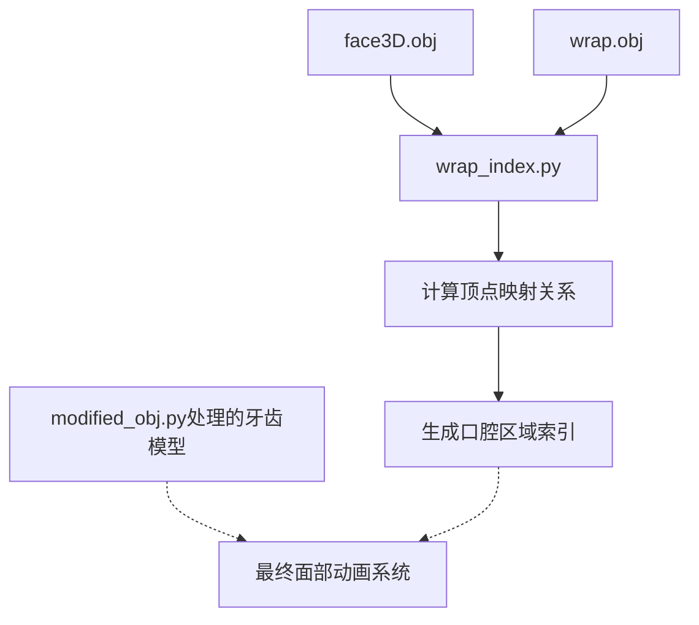
```mermaid
graph TD
    A[face3D.obj] --> C[wrap_index.py]
    B[wrap.obj] --> C
    C --> D[计算顶点映射关系]
    D --> E[生成口腔区域索引]
    F[modified_obj.py处理的牙齿模型] -.-> G[最终面部动画系统]
    E -.-> G
```

### 与modified_obj.py的协同关系

1. **数据预处理链**
   - `modified_obj.py` 优化牙齿模型数据
   - `wrap_index.py` 计算口腔区域与人脸的映射关系

2. **模型整合目的**
   - 牙齿模型（通过`modified_obj.py`优化）
   - 口腔区域（通过`wrap_index.py`映射）
   - 完整人脸模型（face3D.obj）

### 具体应用场景

1. **面部动画生成**
   - 确定口腔区域在人脸上的精确位置
   - 实现牙齿和口腔的正确变形
   - 保证动画的自然性

2. **模型配准**
   - 将优化后的牙齿模型正确放置到面部模型中
   - 确保口腔动画与面部表情同步

### 技术细节

1. **顶点匹配算法**
   ```python
   # 使用欧氏距离找最近点
   dist_list.append(np.linalg.norm(i - vert))
   align_index = np.argmin(dist_list)
   ```

2. **数据结构**
   ```python
   # 3D顶点数据处理
   verts_flame = np.array(verts_face).reshape(-1, 3)
   verts_mouth = np.array(verts_wrap).reshape(-1, 3)
   ```

### 总结

这两个脚本构成了面部动画系统中口腔部分的核心处理流程：
1. `modified_obj.py` 负责优化牙齿模型
2. `wrap_index.py` 负责计算口腔区域映射
3. 两者共同为实时面部动画提供准确的口腔动画支持

这种设计使得系统能够精确地控制口腔区域的动画，同时保持与整体面部表情的协调性。


# `mini_live/obj/image_utils.py` 文件用途

`mini_live/obj/image_utils.py` 文件是一个用于图像处理的工具库，它包含了一系列与图像处理相关的函数。这些函数主要用于图像的裁剪、缩放、关键点检测以及图像显示等功能。下面是对文件中主要函数的用途进行详细解析：

1. **`get_standard_image_(img, kps, crop_coords, resize=(256, 256))`**
   - 用途：对输入的图像进行裁剪、缩放，并调整关键点坐标，生成标准大小的图像和关键点集。
   - 参数：
     - `img`：输入的图像。
     - `kps`：关键点集。
     - `crop_coords`：裁剪区域的坐标。
     - `resize`：输出图像的大小，默认为 (256, 256)。
   - 返回值：裁剪并缩放后的图像和关键点集。

2. **`get_standard_image(img_rgba, source_pts, source_crop_rect, out_size)`**
   - 用途：将输入的RGBA图像和关键点点集转换为标准图像和标准顶点集。
   - 参数：
     - `img_rgba`：输入的RGBA图像。
     - `source_pts`：源点集。
     - `source_crop_rect`：源图像的裁剪矩形。
     - `out_size`：输出图像的大小。
   - 返回值：标准化的图像、标准化的顶点集以及标准化的顶点集的纹理坐标。

3. **`crop_face_from_several_images(pts_array_origin, img_w, img_h)`**
   - 用途：根据多张图像的关键点信息，计算出一个裁剪矩形。
   - 参数：
     - `pts_array_origin`：原始的关键点数组。
     - `img_w`：图像的宽度。
     - `img_h`：图像的高度。
   - 返回值：计算出的裁剪矩形坐标。

4. **`crop_face_from_image(kps, crop_rotio=[0.6, 0.6, 0.65, 1.35])`**
   - 用途：根据关键点信息裁剪出人脸区域。
   - 参数：
     - `kps`：关键点集。
     - `crop_rotio`：裁剪比例的调整参数。
   - 返回值：裁剪区域的坐标。

5. **`check_keypoint(img, pts_)`**
   - 用途：在图像上标记出关键点，并显示图像。
   - 参数：
     - `img`：输入的图像。
     - `pts_`：要标记的关键点集。

6. **`if __name__ == "__main__":`** 部分
   - 用途：提供了一个简单的示例，演示了如何使用上述函数来处理图像和关键点信息。^[1]^

这些函数共同构成了一个强大的图像处理工具库，可以用于各种图像处理任务，如人脸检测、关键点定位、图像裁剪和缩放等。

## 参考文献
[Python脚本执行流程](https://www.runoob.com/python/python-program-structure.html)


让我分析一下`obj_utils.py`的用途，这是一个核心工具文件，负责3D模型的处理和整合：

### 主要功能模块

1. **模型读取功能**
```python
def readObjFile(filepath):
    # 读取.obj文件的各种数据：
    # - 顶点坐标 (v_)
    # - 纹理坐标 (vt)
    # - 法线向量 (vn)
    # - 面信息 (face)
```

2. **MediaPipe人脸模型生成**
```python
def generateRenderInfo_mediapipe():
    # 整合三个关键模型：
    v_face, _, _, _ = readObjFile("face3D.obj")           # 人脸模型
    v_teeth, _, _, _ = readObjFile("modified_teeth_upper.obj")  # 上牙模型
    v_teeth2, _, _, _ = readObjFile("modified_teeth_lower.obj") # 下牙模型
```

3. **顶点分类标记**
```python
# 为不同部位的顶点添加类别标记
vertices[468:478, 5] = 1.      # 眼睛区域
vertices[478:478 + 18, 5] = 2. # 上牙
vertices[478 + 18:478 + 36, 5] = 3. # 下牙
```

### 工作流程

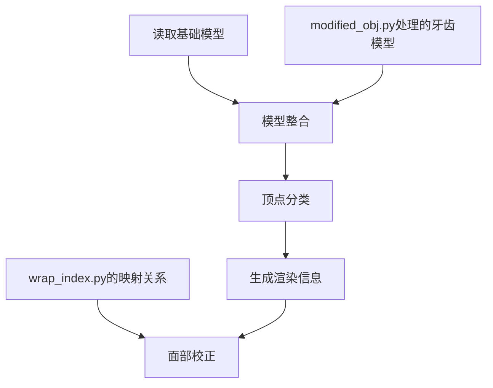
```mermaid
graph TD
    A[读取基础模型] --> B[模型整合]
    B --> C[顶点分类]
    C --> D[生成渲染信息]
    E[modified_obj.py处理的牙齿模型] --> B
    F[wrap_index.py的映射关系] --> G[面部校正]
    D --> G
```

### 关键功能

1. **模型整合**
   - 将人脸、上牙、下牙三个模型合并
   - 保持正确的顶点索引关系
   - 整合纹理和法线信息

2. **面部校正功能**
```python
def NewFaceVerts(render_verts, source_crop_pts, face_pts_mean):
    # 校正牙齿位置
    # 计算上下嘴唇中点
    # 调整牙齿模型位置
```

3. **数据结构处理**
   - 13维顶点数据结构：
     - 0-2: 顶点坐标
     - 3-4: 纹理坐标
     - 5: 类别标记
     - 6: 索引
     - 7-10: 骨骼权重
     - 11-12: 额外纹理坐标

### 与其他文件的关系

1. **与modified_obj.py的关系**
   - 使用modified_obj.py处理过的牙齿模型
   - 整合优化后的牙齿模型

2. **与wrap_index.py的关系**
   - 使用面部映射关系进行位置校正
   - 确保牙齿模型正确放置

### 应用场景

1. **模型预处理**
   - 为实时渲染准备数据
   - 整合多个子模型
   - 建立统一的顶点索引系统

2. **动画控制**
   - 支持面部表情动画
   - 实现牙齿动画效果
   - 保证各部分协调运动

### 核心价值

1. **数据整合**
   - 将分散的3D模型整合成统一的渲染数据
   - 建立标准化的数据结构

2. **位置校正**
   - 确保牙齿模型与面部的正确对齐
   - 实现自然的口腔动画效果

这个工具文件是整个面部动画系统的核心组件，负责模型数据的整合和预处理，为实时渲染提供必要的数据支持。
# `mini_live/obj/utils.py` 文件用途

`mini_live/obj/utils.py` 文件是一个工具库，专门用于图像处理、几何变换和特征提取。它提供了一系列函数，这些函数在计算机视觉、图像处理和三维图形渲染等领域具有广泛的应用。以下是该文件的主要用途概述：

1. **几何变换**：
   - `translation_matrix`：生成平移矩阵，用于图像的平移变换。
   - `rotate_around_point`：围绕指定点进行旋转变换，支持欧拉角输入。
   - `rodrigues_rotation_formula`：使用罗德里格斯旋转公式计算旋转矩阵。
   - `RotateAngle2Matrix`：围绕指定中心点和轴进行旋转变换，生成相应的旋转矩阵。

2. **图像处理**：
   - `crop_mouth`：根据给定的嘴巴关键点裁剪图像中的嘴巴区域。
   - `drawMouth`：在图像上绘制嘴巴特征，包括内唇、外唇和上唇、下唇等。

3. **特征提取与可视化**：
   - 虽然当前文件中未直接包含特征提取函数，但提供的函数可以用于特征提取的预处理步骤，如图像裁剪和旋转，以便更好地提取和分析图像特征。
   - `drawMouth` 函数本身也是一种特征可视化的方式，通过绘制嘴巴特征来帮助理解和分析图像内容。

4. **三维图形渲染**：
   - 提供的几何变换函数可以用于三维图形的渲染和变换，特别是在需要精确控制图形位置和朝向的场景中。

5. **其他应用**：
   - 这些函数还可以应用于其他需要图像处理、几何变换和特征提取的领域，如机器人视觉、自动驾驶、医学影像处理等。

总之，`mini_live/obj/utils.py` 文件是一个功能强大的工具库，为图像处理、几何变换和特征提取提供了丰富的函数支持。它可以帮助开发者在处理图像和三维图形时更加高效和准确。

# `mini_live/obj/wrap_utils.py` 文件用途

`mini_live/obj/wrap_utils.py` 文件主要提供了与面部关键点包装（wrapping）相关的实用功能。这些功能通常用于人脸处理、表情迁移或人脸动画等计算机视觉和图形学应用中。具体来说，该文件包含以下几个方面的用途：

1. **定义关键点索引**：
   - `index_wrap`：定义了一组面部关键点的索引，这些点通常用于构建或识别面部的特定区域或特征。
   - `index_edge_wrap` 和 `index_edge_wrap_upper`：定义了面部边缘关键点的索引，这些点可能用于处理面部的轮廓或边界。

2. **计算平均人脸**：
   - `newWrapModel` 函数：该函数接受一个面部模型（`wrapModel`）和一个个人面部关键点的平均值（`face_pts_mean_personal_primer`）作为输入，然后基于这些输入生成一个新的面部包装模型。
     - 该函数首先复制输入的面部模型，然后根据`index_wrap`索引更新模型中的关键点位置，以匹配输入的平均面部关键点位置。
     - 接着，函数处理面部边缘点，通过计算边缘点的平均值并进行一定的偏移来生成新的边缘点位置。
     - 最后，函数还处理牙齿点，根据上嘴唇和下嘴唇的中点来调整牙齿点的位置，以确保它们与新的面部形状相匹配。

3. **辅助人脸处理任务**：
   - 通过提供面部关键点的索引和面部包装模型的处理函数，该文件为各种人脸处理任务提供了基础工具。例如，在表情迁移应用中，可以使用这些工具来将一个人的表情迁移到另一个人的面部模型上。

4. **与其他模块的集成**：
   - 文件中还引用了其他模块（如`talkingface.utils`）中的索引和函数，这表明该文件是作为一个更大系统或项目的一部分而设计的，旨在与其他模块协同工作以实现更复杂的功能。

总之，`mini_live/obj/wrap_utils.py` 文件是一个专门用于面部关键点包装的工具库，它通过提供关键点索引和面部包装模型的处理函数来支持各种人脸处理任务。


让我分析一下`generate_fusion_mask.py`的用途，这是一个用于生成融合遮罩的工具脚本：

### 主要功能

1. **生成渐变遮罩**
```python
face_fusion_mask = np.zeros([128, 128], dtype = np.uint8)
for i in range(8):
    face_fusion_mask[i:-i,i:-i] = min(255, i*40)
```
- 创建128x128的遮罩图像
- 从边缘向中心渐变
- 用于面部融合时的平滑过渡

2. **处理纹理贴图**
```python
image3 = np.zeros([12, 256, 3], dtype=np.uint8)
image3[:, :len(index_wrap)] = image2[:, index_wrap]
```
- 读取基础纹理贴图
- 根据wrap索引重新排列纹理
- 生成半脸纹理图

### 工作流程

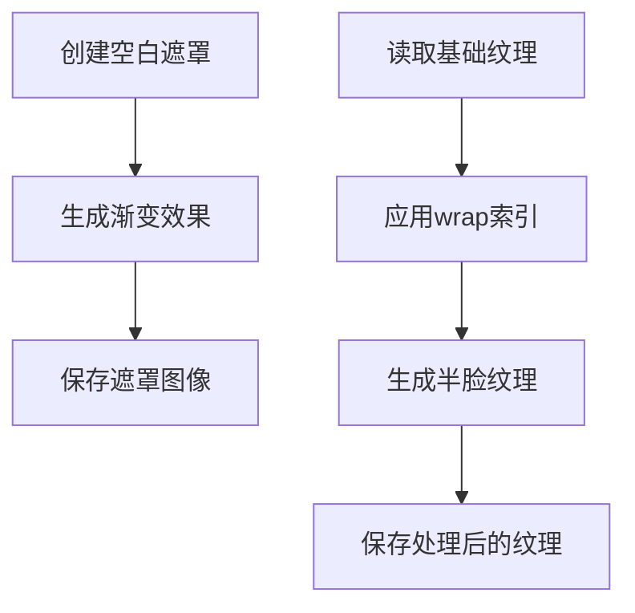
```mermaid
graph TD
    A[创建空白遮罩] --> B[生成渐变效果]
    B --> C[保存遮罩图像]
    D[读取基础纹理] --> E[应用wrap索引]
    E --> F[生成半脸纹理]
    F --> G[保存处理后的纹理]
```

### 应用场景

1. **面部融合**
   - 用于真实面部和3D模型的平滑过渡
   - 避免融合边缘的突兀感
   - 提升视觉效果的自然度

2. **纹理映射**
   - 处理面部纹理贴图
   - 支持半脸渲染
   - 优化纹理内存使用

### 与其他组件的关系

1. **与3D模型处理的关联**
   - 配合`modified_obj.py`的模型处理
   - 与`wrap_index.py`的顶点映射配合
   - 支持`obj_utils.py`的渲染功能

2. **在渲染流程中的位置**
   - 为实时渲染提供必要的遮罩资源
   - 支持纹理映射优化
   - 提供融合效果支持

### 技术细节

1. **遮罩生成算法**
```python
# 8层渐变效果
# 每层增加40的亮度值
# 最大值限制在255
face_fusion_mask[i:-i,i:-i] = min(255, i*40)
```

2. **纹理处理**
```python
# 创建12x256的纹理图
# 使用wrap索引重新排列
image3[:, :len(index_wrap)] = image2[:, index_wrap]
```

### 输出文件

1. **face_fusion_mask.png**
   - 128x128像素
   - 8层渐变效果
   - 用于面部融合

2. **bs_texture_halfFace.png**
   - 12x256像素
   - 优化后的半脸纹理
   - 用于3D模型渲染

### 实际应用价值

1. **视觉效果优化**
   - 提供平滑的融合效果
   - 增强渲染真实感
   - 优化边缘过渡

2. **性能优化**
   - 优化纹理内存占用
   - 提高渲染效率
   - 支持实时处理需求

这个脚本在整个面部动画系统中扮演着重要的辅助角色，为实现自然的面部融合效果和高效的纹理处理提供必要的资源支持。


让我分析一下`opengl_render_interface.py`的用途，这是一个使用OpenGL进行3D面部渲染的核心接口文件：

### 主要功能

1. **渲染模型类(RenderModel)**
```python
class RenderModel:
    def __init__(self, window_size):
        # 初始化OpenGL窗口和上下文
        # 设置着色器程序
        # 初始化缓冲区
```

2. **纹理处理**
```python
def GenTexture(self, img, texture_index = GL_TEXTURE0):
    # 生成和绑定纹理
    # 支持不同格式的图像(RGB/RGBA/灰度)
    # 设置纹理参数
```

3. **渲染管线设置**
```python
def render2cv(self, out_size = (1000, 1000), mat_world=None, bs_array=None):
    # 设置正交投影矩阵
    # 启用深度测试和混合
    # 渲染3D模型
    # 返回渲染结果为OpenCV格式
```

### 工作流程

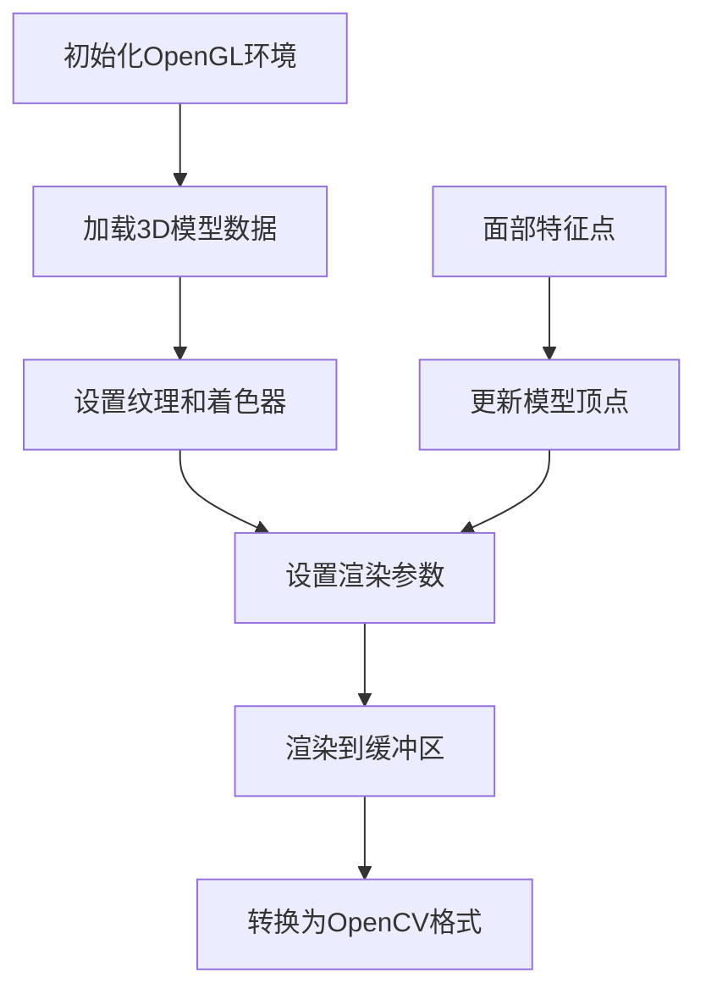
```mermaid
graph TD
    A[初始化OpenGL环境] --> B[加载3D模型数据]
    B --> C[设置纹理和着色器]
    C --> D[设置渲染参数]
    D --> E[渲染到缓冲区]
    E --> F[转换为OpenCV格式]
    G[面部特征点] --> H[更新模型顶点]
    H --> D
```

### 关键功能模块

1. **模型创建函数**
```python
def create_render_model(out_size = (384, 384), floor = 5):
    # 创建渲染模型实例
    # 加载表情纹理
    # 设置初始顶点数据
```

2. **缓冲区管理**
```python
def GenVBO(self, vertices_):
    # 生成顶点缓冲对象
    # 设置顶点属性
    # 13个浮点数/顶点的数据结构
```

### 技术特点

1. **渲染设置**
   - 使用正交投影
   - 启用背面剔除
   - 支持透明混合
   - 深度测试

2. **数据结构**
   - 顶点数据：位置、纹理坐标、权重等
   - 面部特征点：478个关键点
   - 表情系数：12维向量

### 应用场景

1. **实时面部渲染**
   - 支持面部表情动画
   - 实现3D模型实时变形
   - 提供高质量渲染效果

2. **图像合成**
   - 将3D模型渲染到2D图像
   - 支持透明度混合
   - 可调整渲染参数

### 与其他组件的关系

1. **数据输入**
   - 使用`obj_utils.py`提供的模型数据
   - 接收面部特征点数据
   - 处理表情系数输入

2. **渲染输出**
   - 生成RGBA格式图像
   - 支持自定义输出尺寸
   - 提供OpenCV兼容格式

### 核心价值

1. **渲染质量**
   - 高质量3D渲染
   - 支持实时性能
   - 精确的面部表现

2. **灵活性**
   - 可调整渲染参数
   - 支持多种输入格式
   - 易于集成到更大系统

这个接口文件是整个面部动画系统的渲染核心，提供了从3D模型到2D图像的完整渲染流程，支持实时面部动画的生成和渲染。


# `mini_live/render.py` 文件用途

`mini_live/render.py` 文件是一个用于实时渲染人脸图像的Python脚本。它结合了OpenGL和PyOpenGL库来实现3D图形的渲染，并集成了其他工具来处理和转换人脸图像。以下是该文件的主要用途和功能概述：

1. **初始化OpenGL渲染上下文**：
   - 使用`glfw`库创建一个不可见的OpenGL窗口，用于渲染操作。
   - 加载并编译OpenGL着色器程序，包括顶点着色器和片段着色器。

2. **设置渲染内容和纹理**：
   - 通过`setContent`方法设置顶点数据和面数据，这些数据定义了要渲染的3D模型的形状。
   - 使用`GenTexture`方法加载并设置图像纹理，这些纹理将应用于渲染的3D模型上。

3. **生成和更新顶点缓冲区对象（VBO）和元素缓冲区对象（EBO）**：
   - `GenVBO`方法用于生成和更新顶点缓冲区对象，它存储了顶点的位置和纹理坐标。
   - `GenEBO`方法用于生成元素缓冲区对象，它定义了顶点的连接方式，即如何组成三角形或其他多边形。

4. **渲染到图像**：
   - `render2cv`方法使用OpenGL渲染管道将3D模型渲染到图像上。
   - 该方法可以设置输出图像的大小、世界变换矩阵和其他渲染参数。
   - 渲染结果可以直接保存到图像文件中，或用于进一步的图像处理和分析。

5. **人脸处理和动画**：
   - 脚本集成了`talkingface`库中的功能，用于处理人脸图像和关键点。
   - 通过`create_render_model`函数创建一个渲染模型实例，该实例包含了初始的顶点数据、面数据和纹理。
   - 使用`newWrapModel`函数根据输入的人脸关键点调整渲染模型的顶点位置，以实现人脸动画效果。

6. **视频处理和合成**：
   - 脚本能够读取视频文件，并逐帧处理视频中的人脸图像。
   - 使用`Audio2bs`函数将音频文件转换为特征向量，这些特征向量可以用于驱动人脸动画。
   - 将渲染的人脸图像与原始视频帧合成，生成具有动画效果的新视频。

7. **示例使用**：
   - 脚本的末尾提供了一个示例用法，展示了如何加载视频、处理音频、渲染人脸动画以及合成新视频的过程。

总之，`mini_live/render.py` 文件是一个功能强大的工具，它结合了OpenGL渲染、人脸处理和音频特征提取等多种技术，实现了实时人脸动画和视频合成的功能。该文件可以用于创建具有生动表情和动作的虚拟角色，为视频制作、动画制作和虚拟现实等领域提供技术支持。


让我分析一下`train_input_validation.py`的用途，这是一个用于验证训练数据输入的脚本：

### 主要功能

1. **数据加载和筛选**
```python
# 根据图像变化度筛选视频
df = pd.read_csv(r"F:\C\AI\CV\DH008_few_shot\DH0119_mouth64_48/imageVar2.csv")
video_list = df[df["imageVar"] > 265000]["name"].tolist()
```

2. **数据集构建**
```python
# 构建Few-Shot学习数据集
test_set = Few_Shot_Dataset(dict_info, is_train=True, n_ref = 3)
testing_data_loader = DataLoader(dataset=test_set, num_workers=0, batch_size=1, shuffle=False)
```

### 数据流程

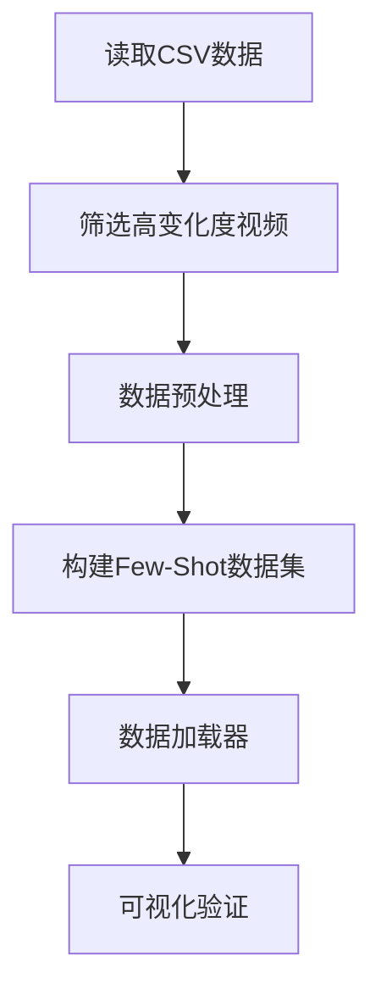
```mermaid
graph TD
    A[读取CSV数据] --> B[筛选高变化度视频]
    B --> C[数据预处理]
    C --> D[构建Few-Shot数据集]
    D --> E[数据加载器]
    E --> F[可视化验证]
```

### 关键组件

1. **数据结构**
```python
# 输入张量结构
source_tensor  # 源图像
ref_tensor     # 参考图像
target_tensor  # 目标图像
```

2. **图像处理函数**
```python
def Tensor2img(tensor_, channel_index):
    # 将张量转换为OpenCV格式图像
    # 处理通道和归一化
```

### 应用场景

1. **训练数据验证**
   - 检查数据加载正确性
   - 验证数据预处理效果
   - 确认Few-Shot学习样本

2. **数据可视化**
   - 显示源图像、参考图像和目标图像
   - 验证数据对齐效果
   - 检查数据增强结果

### 与其他组件的关系

1. **数据预处理**
   - 使用`DHLive_mini_dataset.py`中的数据集类
   - 配合`talkingface/utils.py`的工具函数
   - 为训练模型提供数据验证

2. **模型训练支持**
   - 验证训练数据质量
   - 确保数据格式正确
   - 支持Few-Shot学习训练

### 技术特点

1. **数据筛选**
   - 基于图像变化度筛选
   - 支持批量数据处理
   - 灵活的数据加载方式

2. **可视化功能**
   - 多通道图像显示
   - 实时数据预览
   - 支持交互式检查

### 核心价值

1. **数据质量保证**
   - 验证数据完整性
   - 确保数据格式正确
   - 支持训练质量提升

2. **开发调试支持**
   - 提供可视化工具
   - 便于问题定位
   - 加速开发迭代

这个脚本在整个项目中扮演着数据验证和调试的重要角色，确保了训练数据的质量和正确性，是模型训练过程中的重要辅助工具。


# `mini_live/train.py` 文件用途

`mini_live/train.py` 文件是一个用于训练深度图像到图像转换模型（特别是用于人脸图像生成）的脚本。它集成了多个组件和技术，以实现从输入源图像和目标图像中学习映射关系，并生成与目标图像风格相似的新图像。以下是该文件的详细用途和功能概述：

1. **模型配置和初始化**：
   - 加载配置选项，这些选项指定了训练过程中的各种参数，如批次大小、学习率、训练轮数等。
   - 初始化生成器网络（`DINet`）、判别器网络（`Discriminator`）和感知损失网络（`Vgg19`）。

2. **数据准备**：
   - 从CSV文件中读取视频列表，并根据条件筛选视频。
   - 使用`data_preparation`函数处理视频数据，生成训练所需的格式。
   - 创建`Few_Shot_Dataset`实例，并使用`DataLoader`进行数据的批量加载和打乱。

3. **训练循环**：
   - 在每个训练轮次中，对生成器和判别器网络进行迭代训练。
   - 对于生成器，通过最小化感知损失（使用预训练的VGG19网络提取特征）和对抗性损失（由判别器提供）来优化。
   - 对于判别器，通过最大化对真实图像和生成图像的判别准确性来优化。

4. **损失计算和优化**：
   - 使用GAN损失（对抗性损失）和L1损失（感知损失）来计算总损失。
   - 使用Adam优化器来更新生成器和判别器的参数。

5. **学习率调整**：
   - 根据预设的学习率调度策略，在训练过程中动态调整学习率。

6. **模型保存和日志记录**：
   - 定期保存训练好的模型权重到磁盘，以便后续使用或进一步微调。
   - 使用TensorBoard记录训练过程中的损失、学习率等关键指标，以及生成的示例图像，以便进行可视化和分析。

7. **图像处理和转换**：
   - 提供`Tensor2img`函数，用于将张量转换为图像格式，便于可视化和保存。

8. **随机性和可重复性**：
   - 设置随机种子以确保实验的可重复性。

总的来说，`mini_live/train.py` 是一个功能齐全的模型训练脚本，它集成了数据准备、模型训练、损失计算、优化、学习率调整、模型保存和日志记录等多个环节，旨在通过深度学习方法实现高效的人脸图像生成。

# `talkingface/config/config.py` 文件用途

`talkingface/config/config.py` 文件是一个配置管理模块，它定义了与 `talkingface` 项目相关的多个配置类，这些类包含了训练、推理和数据处理等任务中所需的参数。该文件的主要用途是为项目提供一个集中管理和配置各种参数的方式，使得项目更容易维护和扩展。

具体来说，该文件包含三个主要的配置类：

1. **DataProcessingOptions**：
   - 这个类用于配置数据处理相关的参数，如视频帧提取、音频提取、深度语音特征提取、人脸裁剪和训练数据JSON文件的生成等。
   - 它还包含了源文件目录、音频目录、裁剪人脸目录等多个路径参数，以及裁剪长度、深度语音模型路径等其他相关参数。

2. **DINetTrainingOptions**：
   - 这个类用于配置DINet模型训练相关的参数，如随机种子、输入源图像通道数、参考图像通道数、音频通道数、训练数据增强数量、训练批次大小、感知损失权重、学习率、训练轮数、检查点间隔等。
   - 它还包含了判别器相关的参数，如判别器块数、块扩展大小、最大特征通道数等。

3. **DINetInferenceOptions**：
   - 这个类用于配置DINet模型推理相关的参数，如源图像通道数、参考图像通道数、音频特征通道数、源视频路径、源视频人脸关键点路径、驱动音频路径、预训练模型路径、深度语音模型路径和生成视频保存目录等。

每个配置类都通过`argparse`库来定义参数，并提供了`parse_args`方法来解析命令行参数或加载配置文件。这种方式使得配置参数既可以通过命令行指定，也可以通过配置文件指定，增加了配置的灵活性。

总的来说，`talkingface/config/config.py` 文件是 `talkingface` 项目中配置管理的重要组成部分，它为项目的不同任务提供了必要的参数配置，使得项目能够根据不同的需求进行定制和调整。


让我分析一下`dataset_wav.py`的用途，这是一个音频-视觉数据集的核心实现文件：

### 主要功能

1. **音视频数据集类(AudioVisualDataset)**
```python
class AudioVisualDataset(data.Dataset):
    # 处理音频特征和口型特征的配对数据
    # 支持训练时的数据增强
    # 实现序列化数据加载
```

### 数据结构

1. **输入数据**
```python
def __init__(self, audio_features, mouth_features, is_train = True, seq_len = 9):
    self.audio_features = audio_features  # 音频特征列表
    self.bs_features = mouth_features     # 口型特征列表(blendshape)
    self.seq_len = seq_len               # 序列长度
```

2. **音频处理参数**
```python
self.fps = 25                    # 视频帧率
self.frame_jump_stride = 2       # 帧跳跃步长
```

### 核心功能

1. **音频增强**
```python
self.augment = Compose([
    AddGaussianNoise(),          # 添加高斯噪声
    PolarityInversion(),         # 极性反转
    PitchShift(),               # 音高变换
])
```

2. **特征提取**
```python
# Fbank特征提取设置
opts = knf.FbankOptions()
opts.frame_opts.frame_length_ms = 50
opts.frame_opts.frame_shift_ms = 20
opts.mel_opts.num_bins = 80
```

### 工作流程

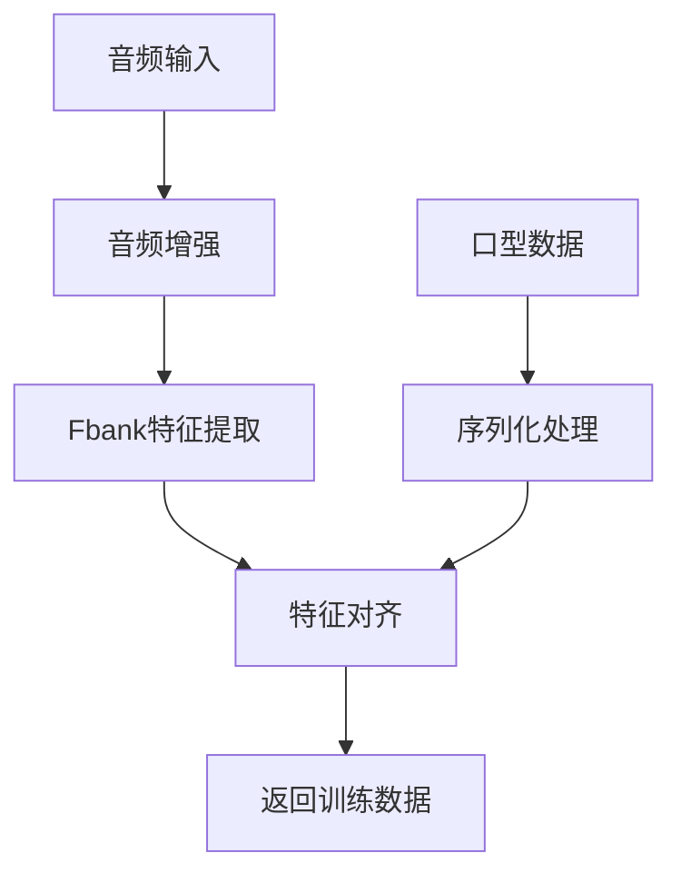
```mermaid
graph TD
    A[音频输入] --> B[音频增强]
    B --> C[Fbank特征提取]
    D[口型数据] --> E[序列化处理]
    C --> F[特征对齐]
    E --> F
    F --> G[返回训练数据]
```

### 应用场景

1. **训练数据准备**
   - 语音驱动的面部动画训练
   - 音视频同步学习
   - 口型生成模型训练

2. **数据增强**
   - 提高模型鲁棒性
   - 扩充训练数据
   - 增加数据多样性

### 技术特点

1. **音频处理**
   - 使用kaldi_native_fbank提取特征
   - 支持多种音频增强方法
   - 精确的时间对齐

2. **数据组织**
   - 序列化数据处理
   - 灵活的采样策略
   - 训练/测试模式切换

### 关键参数

```python
# 音频参数
sample_rate = 16000            # 采样率
frame_length_ms = 50          # 帧长
frame_shift_ms = 20           # 帧移
num_bins = 80                # Mel滤波器组数量

# 序列参数
seq_len = 9                  # 序列长度
fps = 25                     # 视频帧率
```

### 与其他组件的关系

1. **数据流向**
   - 为训练模型提供数据
   - 与音频处理模块配合
   - 支持面部动画生成

2. **系统集成**
   - 配合render模块使用
   - 支持实时推理需求
   - 与训练流程对接

### 核心价值

1. **数据质量**
   - 确保音视频同步
   - 提供高质量训练数据
   - 支持数据增强

2. **训练支持**
   - 灵活的数据加载
   - 高效的批处理
   - 可靠的特征提取

这个数据集实现是整个语音驱动面部动画系统的重要组成部分，为模型训练提供了高质量的音视频配对数据。

`DHLive_mini_dataset.py` 文件的用途通常与其命名和内容相关。基于文件名 `DHLive_mini_dataset.py`，我们可以推测该文件可能用于处理或加载名为 `DHLive` 的一个小型数据集。具体来说，该文件可能包含以下一些功能：

1. **数据加载**：从磁盘或其他存储介质中读取 `DHLive` 数据集。
2. **数据预处理**：对数据集进行必要的预处理，如归一化、裁剪、增强等。
3. **数据划分**：将数据集划分为训练集、验证集和测试集（如果适用）。
4. **数据迭代器**：提供数据迭代器或数据加载器，以便在训练深度学习模型时批量获取数据。

为了更准确地了解该文件的用途，你可以查看其代码内容，特别是以下部分：

- **导入的库和模块**：了解文件使用了哪些外部库或框架。
- **类和方法定义**：查看是否有定义专门用于处理数据集的类或方法。
- **数据加载逻辑**：检查数据是如何被加载和预处理的。
- **数据划分逻辑**：如果有的话，查看数据集是如何被划分的。

以下是一个简化的示例，展示了 `DHLive_mini_dataset.py` 文件可能包含的一些内容：

```python
import os
import paddle
from paddle.io import Dataset, DataLoader
from PIL import Image
import numpy as np

# 假设的DHLiveMiniDataset类
class DHLiveMiniDataset(Dataset):
    def __init__(self, data_dir, transform=None):
        self.data_dir = data_dir
        self.transform = transform
        self.image_files = [os.path.join(data_dir, f) for f in os.listdir(data_dir) if f.endswith('.jpg') or f.endswith('.png')]

    def __getitem__(self, idx):
        image_path = self.image_files[idx]
        image = Image.open(image_path).convert('RGB')
        if self.transform:
            image = self.transform(image)
        label = self.get_label(image_path)  # 假设有一个方法来获取标签
        return image, label

    def __len__(self):
        return len(self.image_files)

    def get_label(self, image_path):
        # 这里应该有一些逻辑来确定标签，但为简化起见，我们省略了它
        return 0  # 假设所有图像都有相同的标签（在实际应用中，这通常不是真的）

# 示例：如何使用DHLiveMiniDataset
def main():
    data_dir = 'path/to/dhlive_mini_dataset'
    transform = paddle.vision.transforms.Compose([
        paddle.vision.transforms.Resize((224, 224)),
        paddle.vision.transforms.ToTensor()
    ])
    dataset = DHLiveMiniDataset(data_dir, transform)
    dataloader = DataLoader(dataset, batch_size=32, shuffle=True)

    for batch_id, (images, labels) in enumerate(dataloader):
        # 在这里处理每个批次的数据
        print(f'Batch {batch_id}: images shape {images.shape}, labels {labels}')

if __name__ == '__main__':
    main()
```

请注意，上述代码仅是一个示例，实际文件的内容可能与此有所不同。要准确了解 `DHLive_mini_dataset.py` 文件的用途，你需要查看其具体的实现细节。

# `face_mask.py` 文件用途

## 1. 文件概述

`face_mask.py` 文件是 Python 脚本，主要用于处理面部关键点数据，并生成与这些面部关键点相关的数据文件和变换矩阵。该脚本主要用于与面部相关的数据预处理任务，特别是在进行面部动画或面部替换等应用时。

## 2. 主要功能

### 2.1 加载视频列表

- 脚本首先定义了多个路径，这些路径指向包含视频文件的目录。
- 通过遍历这些目录，脚本收集了所有视频文件的路径，并将它们存储在 `video_list` 列表中。

### 2.2 处理视频中的图像

- 对于 `video_list` 中的每个视频路径，脚本会查找并排序该视频目录下的所有 `.png` 图像文件。
- 如果视频目录中没有图像文件，则跳过该视频。

### 2.3 加载和处理面部关键点数据

- 对于每个视频，脚本会加载与该视频关联的面部关键点数据（通常是从一个 `.pkl` 文件中读取的）。
- 这些面部关键点数据经过平滑处理，并转换为标准化坐标。

### 2.4 计算面部变换矩阵

- 使用 `calc_face_mat` 函数，脚本根据面部关键点数据计算变换矩阵。
- 这些变换矩阵用于将面部从一个位置或形状变换到另一个位置或形状。

### 2.5 更新面部平均关键点

- 脚本会根据加载的面部关键点数据更新面部平均关键点的位置。
- 这对于后续的面部动画或替换任务非常重要，因为它提供了关于面部形状和位置的基准信息。

### 2.6 保存结果

- 最后，脚本将计算出的变换矩阵和更新后的面部平均关键点保存到一个新的 `.pkl` 文件中。
- 这个文件可以在后续的面部处理任务中被重用。

## 3. 总结

`face_mask.py` 文件是一个用于处理面部关键点数据的 Python 脚本。它通过加载视频中的图像和面部关键点数据，计算变换矩阵，并更新面部平均关键点位置来生成有用的预处理数据。这些预处理数据对于面部动画、面部替换等应用非常重要。


让我分析一下`few_shot_dataset.py`的用途，这是一个实现Few-Shot学习的面部数据集核心文件：

### 主要功能

1. **数据预处理和组织**
```python
def data_preparation(train_video_list):
    # 处理训练视频列表
    # 提取关键点和面部遮罩
    # 生成面部变换矩阵
```

2. **图像生成和处理**
```python
def generate_input(img, keypoints, mask_keypoints, is_train = False, mode=["mouth_bias"]):
    # 裁剪面部区域
    # 生成面部特征图
    # 处理嘴部区域
```

### 核心功能模块

1. **Few-Shot数据集类**
```python
class Few_Shot_Dataset(data.Dataset):
    def __init__(self, dict_info, n_ref = 2, is_train = False):
        # 驱动图像序列
        # 关键点数据
        # 面部遮罩数据
```

2. **参考图像选择**
```python
def select_ref_index(driven_keypoints, n_ref = 5, ratio = 1/3.):
    # 基于嘴部开合度选择参考帧
    # 随机采样参考图像
```

### 工作流程

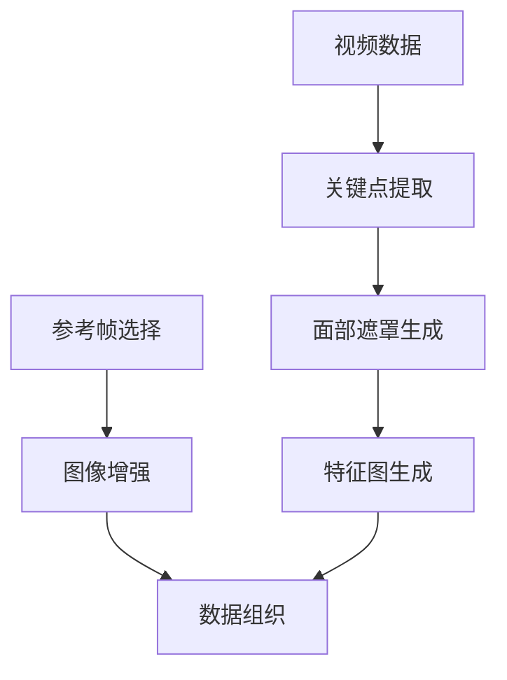
```mermaid
graph TD
    A[视频数据] --> B[关键点提取]
    B --> C[面部遮罩生成]
    C --> D[特征图生成]
    E[参考帧选择] --> F[图像增强]
    F --> G[数据组织]
    D --> G
```

### 技术特点

1. **图像处理**
   - 面部区域裁剪
   - 特征图生成
   - 嘴部区域处理
   - 色彩增强

2. **数据增强**
```python
# 随机调整亮度和对比度
self.alpha = (random.random() > 0.5)
self.beta = np.ones([256,256,3]) * np.random.rand(3) * 20
```

### 应用场景

1. **Few-Shot学习**
   - 面部表情生成
   - 口型同步
   - 表情迁移

2. **数据预处理**
   - 面部特征提取
   - 关键点标注
   - 图像对齐

### 关键特性

1. **面部处理**
```python
# 面部特征处理
draw_face_feature_maps(ref_keypoints, mode=["mouth", "nose", "eye", "oval_all","muscle"])
```

2. **数据组织**
```python
dict_info = {
    "driven_images": img_all,
    "driven_keypoints": keypoints_all,
    "driving_keypoints": keypoints_all,
    "driven_mask_keypoints": mask_all
}
```

### 与其他组件关系

1. **数据流向**
   - 为训练模型提供数据
   - 与渲染系统对接
   - 支持实时推理

2. **依赖关系**
   - 使用talkingface工具函数
   - 与OpenGL渲染接口配合
   - 支持音频驱动系统

### 核心价值

1. **训练支持**
   - Few-Shot学习数据准备
   - 高质量训练样本
   - 灵活的数据增强

2. **系统集成**
   - 标准化数据接口
   - 完整的处理流程
   - 可扩展的设计

这个文件是整个面部动画系统中Few-Shot学习的核心支持组件，为实现高质量的面部表情生成提供了必要的数据支持。


# `Discriminator.py` 文件用途

## 1. 文件概述

`Discriminator.py` 文件定义了一个用于生成对抗网络（GAN）中的判别器（Discriminator）模型。该文件包含了两个主要的类：`DownBlock2d` 和 `Discriminator`。其中，`DownBlock2d` 是一个用于构建判别器的基础模块，而 `Discriminator` 则是整个判别器的实现。

## 2. 类详细说明

### 2.1 `DownBlock2d` 类

- **用途**：`DownBlock2d` 是一个二维下采样模块，用于在判别器的构建过程中进行特征提取和降维。
- **主要成员**：
  - `__init__` 方法：初始化模块，包括一个二维卷积层（`nn.Conv2d`）和一个可选的平均池化层（`F.avg_pool2d`）。
  - `forward` 方法：定义了数据的前向传播过程，包括卷积操作、Leaky ReLU激活函数以及可选的平均池化操作。

### 2.2 `Discriminator` 类

- **用途**：`Discriminator` 类实现了判别器的整体结构，用于区分真实图像和生成图像。
- **主要成员**：
  - `__init__` 方法：初始化判别器，包括多个 `DownBlock2d` 模块和一个最终的卷积层。`DownBlock2d` 模块的数量和配置可以通过参数进行自定义。
  - `forward` 方法：定义了判别器的前向传播过程。数据依次通过多个 `DownBlock2d` 模块进行特征提取和降维，最后通过一个卷积层输出判别结果。同时，该方法还返回了每个 `DownBlock2d` 模块的输出特征图，这些特征图可以用于后续的分析或可视化。

## 3. 文件用途总结

`Discriminator.py` 文件的主要用途是提供一个用于GAN中的判别器模型实现。通过组合多个 `DownBlock2d` 模块和一个最终的卷积层，该判别器能够有效地对输入图像进行特征提取和降维，并输出判别结果。同时，通过返回每个 `DownBlock2d` 模块的输出特征图，该文件还为后续的分析和可视化提供了便利。


让我分析一下`VGG19.py`的用途，这是一个用于感知损失(Perceptual Loss)计算的VGG19网络实现：

### 主要功能

1. **VGG19特征提取**
```python
class Vgg19(torch.nn.Module):
    def __init__(self, requires_grad=False):
        # 加载预训练VGG19模型
        # 分割网络为5个特征层级
        # 设置均值和标准差用于标准化
```

### 网络结构

1. **特征层级划分**
```python
self.slice1 = torch.nn.Sequential()  # conv1_2
self.slice2 = torch.nn.Sequential()  # conv2_2
self.slice3 = torch.nn.Sequential()  # conv3_2
self.slice4 = torch.nn.Sequential()  # conv4_2
self.slice5 = torch.nn.Sequential()  # conv5_2
```

### 应用场景

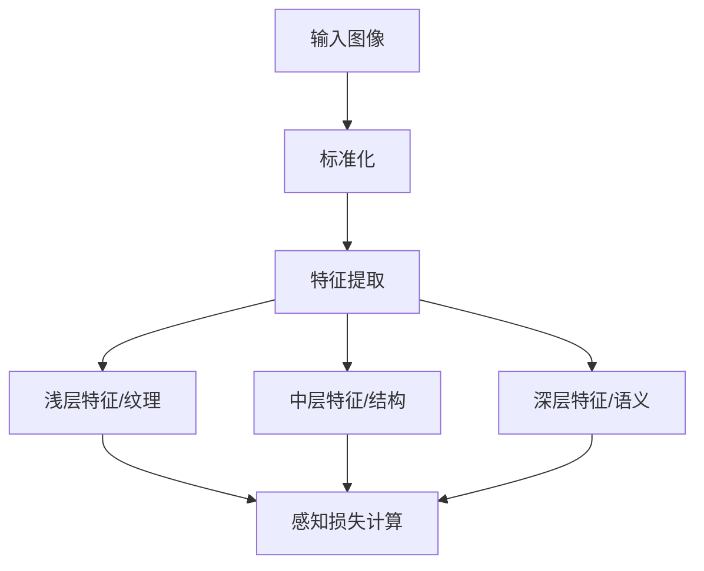
```mermaid
graph TD
    A[输入图像] --> B[标准化]
    B --> C[特征提取]
    C --> D1[浅层特征/纹理]
    C --> D2[中层特征/结构]
    C --> D3[深层特征/语义]
    D1 --> E[感知损失计算]
    D2 --> E
    D3 --> E
```

### 技术特点

1. **预处理标准化**
```python
# ImageNet数据集的标准化参数
self.mean = torch.nn.Parameter(data=torch.Tensor([0.485, 0.456, 0.406]))
self.std = torch.nn.Parameter(data=torch.Tensor([0.229, 0.224, 0.225]))
```

2. **梯度控制**
```python
if not requires_grad:
    for param in self.parameters():
        param.requires_grad = False
```

### 在项目中的作用

1. **感知损失计算**
   - 用于评估生成图像的视觉质量
   - 捕捉不同层级的特征差异
   - 指导面部生成的细节还原

2. **特征提取**
   - 提取多层级视觉特征
   - 支持风格迁移
   - 增强生成效果的真实感

### 与其他组件的关系

1. **训练流程**
   - 配合Few-Shot数据集使用
   - 为生成模型提供损失指导
   - 支持面部表情迁移

2. **质量评估**
   - 评估生成图像质量
   - 保证面部细节还原
   - 增强视觉真实感

### 核心价值

1. **质量保证**
   - 提供高级视觉特征比较
   - 确保生成结果的自然性
   - 增强细节保真度

2. **训练优化**
   - 提供多层级损失指导
   - 加速训练收敛
   - 提升生成质量

这个VGG19实现在整个面部动画系统中扮演着质量评估和特征提取的重要角色，是保证生成结果质量的关键组件。

# `audio2bs_lstm.py` 文件用途

## 1. 文件概述

`audio2bs_lstm.py` 文件定义了一个名为 `Audio2Feature` 的类，该类是一个基于LSTM（长短期记忆网络）的音频特征提取模型。该模型旨在将音频特征转换为更高级别的特征表示，以便用于后续的音频处理或分析任务。

## 2. 类结构与功能

### `Audio2Feature` 类

- **初始化方法 `__init__`**：
  - 在这个方法中，模型定义了其内部结构，包括一个下采样模块 `downsample`、一个LSTM层 `LSTM` 和一个全连接层 `fc`。
  - `downsample` 模块由两个线性层、一个批归一化层和一个Leaky ReLU激活函数组成，用于对输入的音频特征进行初步处理。
  - `LSTM` 层用于捕捉音频序列中的时间依赖性。
  - `fc` 层是一个由多个全连接层、批归一化层和Leaky ReLU激活函数组成的堆叠结构，用于将LSTM的输出转换为最终的特征表示。

- **前向传播方法 `forward`**：
  - 该方法接收音频特征 `audio_features`、LSTM的初始隐藏状态 `h0` 和细胞状态 `c0` 作为输入。
  - 首先，对输入的音频特征进行重塑和下采样处理。
  - 然后，将处理后的音频特征输入到LSTM层中，以捕捉音频序列的时间依赖性。
  - 最后，将LSTM的输出通过全连接层进行处理，得到最终的特征表示，并返回预测结果以及LSTM的最终隐藏状态和细胞状态。

## 3. 文件用途

`audio2bs_lstm.py` 文件的主要用途是提供一个基于LSTM的音频特征提取模型。该模型可以将原始的音频特征转换为更高级别的特征表示，这些特征表示可以进一步用于音频分类、识别、合成等任务中。通过调整模型的结构和参数，可以使其适应不同的音频处理任务需求。


让我分析一下`DINet_mini.py`的用途，这是一个用于面部动画生成的深度学习模型实现：

### 主要组件

1. **基础模块**
```python
# 基础网络块
class DownBlock2d      # 下采样模块
class UpBlock2d       # 上采样模块
class ResBlock2d      # 残差模块
class SameBlock2d     # 保持尺寸模块
```

2. **自适应变换模块(AdaAT)**
```python
class AdaAT(nn.Module):
    # 实现自适应仿射变换
    # 处理特征的空间变换
    # 支持旋转、缩放和平移
```

### 核心网络结构

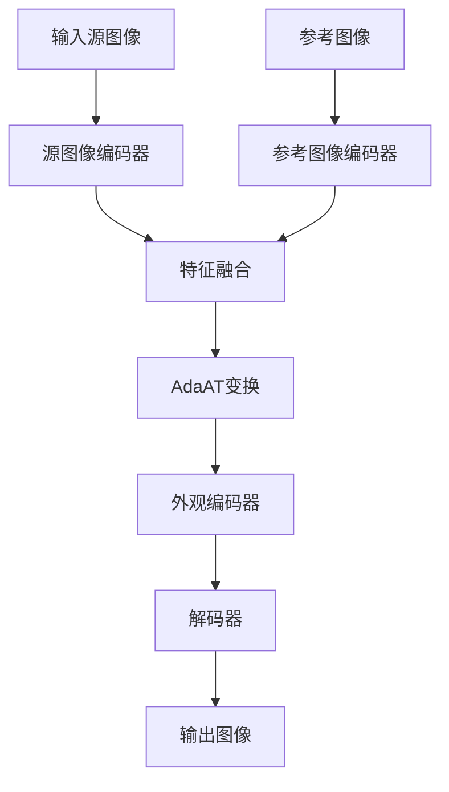
```mermaid
graph TD
    A[输入源图像] --> B[源图像编码器]
    C[参考图像] --> D[参考图像编码器]
    B --> E[特征融合]
    D --> E
    E --> F[AdaAT变换]
    F --> G[外观编码器]
    G --> H[解码器]
    H --> I[输出图像]
```

### 主要功能模块

1. **DINet_mini**
```python
class DINet_mini(nn.Module):
    def __init__(self, source_channel, ref_channel, cuda = True):
        # 源图像编码器
        self.source_in_conv
        # 参考图像编码器
        self.ref_in_conv
        # 变换编码器
        self.trans_conv
        # 外观编码器
        self.appearance_conv
```

2. **DINet_mini_pipeline**
```python
class DINet_mini_pipeline(nn.Module):
    # 完整的推理流程
    # 包含面部融合
    # 处理嘴部区域
```

### 技术特点

1. **特征处理**
   - 多尺度特征提取
   - 自适应特征变换
   - 特征融合机制

2. **变换控制**
```python
# 变换参数生成
scale = self.scale(para_code)      # 缩放
angle = self.rotation(para_code)    # 旋转
translation = self.translation(para_code)  # 平移
```

### 应用场景

1. **面部动画生成**
   - 表情迁移
   - 口型同步
   - 面部融合

2. **实时渲染**
   - 支持实时推理
   - 流水线处理
   - 质量控制

### 核心处理流程

1. **特征提取**
```python
# 源图像和参考图像的特征提取
source_in_feature = self.source_in_conv(source_img)
ref_in_feature = self.ref_in_conv(ref_img)
```

2. **特征变换**
```python
# 自适应特征变换
ref_trans_feature = self.adaAT(ref_in_feature, img_para)
ref_trans_feature = self.appearance_conv(ref_trans_feature)
```

3. **图像生成**
```python
# 特征融合和图像生成
merge_feature = torch.cat([source_in_feature, ref_trans_feature], 1)
out = self.out_conv(merge_feature)
```

### 与其他组件的关系

1. **数据流向**
   - 接收Few-Shot数据集输入
   - 与OpenGL渲染接口配合
   - 输出到面部动画系统

2. **模型集成**
   - 使用VGG19特征提取
   - 配合面部融合mask
   - 支持实时推理需求

### 核心价值

1. **生成质量**
   - 高质量面部动画
   - 自然的表情迁移
   - 精确的口型同步

2. **实用性能**
   - 支持实时处理
   - 灵活的架构设计
   - 可控的变换效果

这个模型是整个面部动画系统的核心生成组件，通过深度学习技术实现高质量的面部动画生成和表情迁移。


# `DINet.py` 文件用途

## 1. 文件概述

`DINet.py` 文件定义了一个名为 `DINet_five_Ref` 的深度神经网络模型，该模型主要用于图像处理和生成任务。该模型结合了多种神经网络组件，包括卷积层、池化层、残差块、上采样块、自适应池化层等，以实现复杂的图像处理功能。

## 2. 主要组件与功能

### 2.1 基础块（Basic Blocks）

- **ResBlock1d/2d**：一维/二维残差块，用于构建深度残差网络，通过跳跃连接缓解梯度消失问题，提升网络性能。
- **UpBlock2d**：二维上采样块，通过插值和卷积操作实现特征图的上采样。
- **DownBlock1d/2d**：一维/二维下采样块，通过卷积和池化操作实现特征图的降维和抽象。
- **SameBlock1d/2d**：一维/二维同尺寸块，仅通过卷积操作处理特征图，不改变其尺寸。

### 2.2 AdaAT 操作符

- **AdaAT**：自适应仿射变换操作符，根据输入的特征图和参数代码，对特征图进行空间变形，包括缩放、旋转和平移等操作，增强模型的表达能力。

### 2.3 DINet_five_Ref 模型

- **source_in_conv**：源图像输入卷积层，对源图像进行初步的特征提取。
- **ref_in_conv**：参考图像输入卷积层，对参考图像进行特征提取。
- **trans_conv**：转换卷积层，对源图像和参考图像的特征进行融合和转换。
- **appearance_conv_list**：外观卷积列表，包含多个残差块，用于进一步处理参考图像的特征。
- **adaAT**：应用 AdaAT 操作符对参考图像特征进行空间变形。
- **out_conv**：输出卷积层，将融合后的特征转换为最终的输出图像。
- **global_avg2d/1d**：全局平均池化层，用于特征降维。

## 3. 文件用途

`DINet.py` 文件的主要用途是提供一个基于深度学习的图像处理模型 `DINet_five_Ref`，该模型能够处理源图像和参考图像，通过复杂的神经网络结构实现图像的特征提取、融合、转换和生成。该模型可能用于图像编辑、图像风格迁移、图像超分辨率等任务，具体应用场景取决于模型的输入数据和训练目标。


让我分析一下`speed_test.py`的用途，这是一个用于测试音频到表情特征模型性能的脚本：

### 主要功能

1. **模型性能测试**
```python
# 测试Audio2Feature模型的计算量和参数量
flops, params = profile(model.to(device), inputs=(x, h0, c0))
flops, params = clever_format([flops, params], "%.3f")
```


### 测试对象

1. **Audio2Feature模型**
```python
model = Audio2Feature()  # 音频到表情特征的LSTM模型
```


### 测试数据

```python
# 模拟输入数据
x = torch.ones((1, 2, 80))     # 音频特征输入
h0 = torch.zeros(2, 1, 192)    # LSTM初始隐藏状态
c0 = torch.zeros(2, 1, 192)    # LSTM初始单元状态
```


### 测试流程

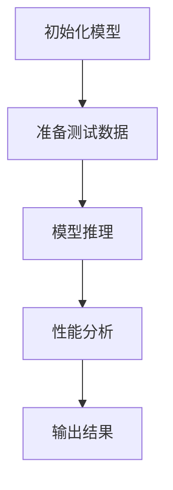
```mermaid
graph TD
    A[初始化模型] --> B[准备测试数据]
    B --> C[模型推理]
    C --> D[性能分析]
    D --> E[输出结果]
```


### 性能指标

1. **计算量统计**
   - FLOPs (浮点运算次数)
   - 衡量模型计算复杂度

2. **参数量统计**
   - 模型参数总数
   - 衡量模型大小

### 应用场景

1. **性能优化**
   - 模型效率评估
   - 计算资源需求分析
   - 实时性能验证

2. **部署评估**
   - 硬件需求评估
   - 实时性能预测
   - 资源占用分析

### 与其他组件的关系

1. **模型关联**
   - 测试`audio2bs_lstm.py`中的模型
   - 支持音频驱动系统
   - 验证实时处理能力

2. **系统集成**
   - 为模型部署提供依据
   - 指导性能优化
   - 支持系统设计决策

### 技术特点

1. **测试设置**
```python
device = "cpu"  # 在CPU上进行测试
model.eval()    # 设置为评估模式
```


2. **性能分析**
```python
# 使用thop库进行性能分析
from thop import profile
from thop import clever_format
```


### 核心价值

1. **性能评估**
   - 提供客观性能数据
   - 支持优化决策
   - 验证实时性能

2. **部署支持**
   - 硬件需求评估
   - 性能瓶颈分析
   - 优化方向指导

这个脚本在整个面部动画系统中扮演着性能验证的重要角色，为系统的实时性能优化和部署提供了必要的数据支持。

# `get_data.py` 文件用途

## 1. 文件概述

`get_data.py` 文件定义了一个名为 `GetData` 的类，该类用于下载 CycleGAN 或 pix2pix 数据集。这个类提供了一个用户友好的接口，允许用户通过简单的命令行交互来下载和保存所需的数据集。

## 2. 主要功能

### 2.1 初始化 (`__init__` 方法)

- 接收两个参数：`technique`（默认为 `'cyclegan'`）和 `verbose`（默认为 `True`）。
- 根据 `technique` 参数的值，设置下载数据的 URL。
- 初始化 `verbose` 标志，用于控制是否打印额外的信息。

### 2.2 打印信息 (`_print` 方法)

- 根据 `verbose` 标志的值，决定是否打印给定的文本信息。

### 2.3 获取数据集选项 (`_get_options` 方法)

- 使用 BeautifulSoup 解析 HTML 页面，提取所有以 `.zip` 或 `.tar.gz` 结尾的链接作为数据集选项。

### 2.4 显示数据集选项 (`_present_options` 方法)

- 从 HTML 页面获取数据集选项，并在命令行中显示给用户。
- 用户通过输入数字选择想要下载的数据集。

### 2.5 下载数据 (`_download_data` 方法)

- 根据用户选择的数据集 URL 和保存路径，下载数据集文件。
- 根据文件扩展名（`.tar.gz` 或 `.zip`），使用相应的解压工具解压文件。
- 解压后将文件移动到指定的保存路径，并删除临时下载的文件。

### 2.6 获取数据集 (`get` 方法)

- 是类的主要入口点，允许用户指定保存路径和（可选的）特定数据集。
- 如果未指定数据集，则显示数据集选项供用户选择。
- 下载并解压选定的数据集，返回数据集的绝对路径。

## 3. 使用示例

```python
from util.get_data import GetData

# 创建一个 GetData 实例，指定使用 CycleGAN 技术
gd = GetData(technique='cyclegan')

# 下载数据集到 './datasets' 目录
new_data_path = gd.get(save_path='./datasets')

# 输出下载的数据集路径
print(new_data_path)
```

## 4. 总结

`get_data.py` 文件提供了一个方便的工具，用于下载和管理 CycleGAN 或 pix2pix 数据集。通过命令行交互，用户可以轻松选择并下载所需的数据集，无需手动处理复杂的下载和解压过程。


让我分析一下`html.py`的用途，这是一个用于生成训练可视化网页的工具类：

### 主要功能

1. **HTML页面生成**
```python
class HTML:
    def __init__(self, web_dir, title, refresh=0):
        # 初始化网页目录和标题
        # 创建图像存储目录
        # 设置自动刷新
```


### 核心功能模块

1. **页面结构管理**
```python
def add_header(self, text):
    # 添加标题文本
    with self.doc:
        h3(text)
```


2. **图像展示**
```python
def add_images(self, ims, txts, links, width=400):
    # 添加图像表格
    # 支持图像说明
    # 支持图像链接
```


### 使用场景

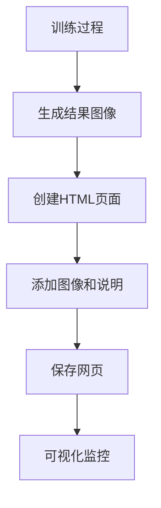
```mermaid
graph TD
    A[训练过程] --> B[生成结果图像]
    B --> C[创建HTML页面]
    C --> D[添加图像和说明]
    D --> E[保存网页]
    E --> F[可视化监控]
```


### 主要特点

1. **文件组织**
```python
self.web_dir = web_dir          # 网页目录
self.img_dir = os.path.join(self.web_dir, 'images')  # 图像目录
```


2. **页面布局**
```python
# 表格式布局
self.t = table(border=1, style="table-layout: fixed;")
```


### 应用场景

1. **训练监控**
   - 可视化训练结果
   - 展示生成样本
   - 记录训练进度

2. **结果展示**
   - 展示模型效果
   - 对比实验结果
   - 记录实验过程

### 与其他组件的关系

1. **训练流程集成**
   - 配合训练脚本使用
   - 支持实验结果记录
   - 辅助模型调试

2. **可视化支持**
   - 与`visualizer.py`配合
   - 支持训练监控
   - 提供结果展示

### 技术特点

1. **DOM操作**
```python
# 使用dominate库进行DOM操作
self.doc = dominate.document(title=title)
```


2. **自动刷新**
```python
# 支持页面自动刷新
if refresh > 0:
    with self.doc.head:
        meta(http_equiv="refresh", content=str(refresh))
```


### 核心价值

1. **可视化支持**
   - 直观展示结果
   - 便于实验对比
   - 支持进度监控

2. **开发支持**
   - 辅助调试过程
   - 记录实验结果
   - 便于结果分享

### 示例使用

```python
# 创建HTML页面
html = HTML('web/', 'test_html')
html.add_header('hello world')

# 添加图像
ims, txts, links = [], [], []
for n in range(4):
    ims.append('image_%d.png' % n)
    txts.append('text_%d' % n)
    links.append('image_%d.png' % n)
html.add_images(ims, txts, links)
```

这个工具类在整个面部动画系统中扮演着训练过程可视化和结果展示的重要角色，为模型开发和调试提供了必要的可视化支持。


# `image_pool.py` 文件用途

## 1. 文件概述

`image_pool.py` 文件定义了一个名为 `ImagePool` 的类，该类实现了一个图像缓冲区，用于存储之前生成的图像。这个缓冲区的主要目的是在训练生成对抗网络（GAN）时，为判别器提供一个历史生成的图像集合，而不是仅仅使用最新生成的图像进行更新。

## 2. 主要功能

### 2.1 初始化 (`__init__` 方法)

- 接收一个参数 `pool_size`，表示图像缓冲区的大小。
- 如果 `pool_size` 为 0，则不创建缓冲区。
- 如果 `pool_size` 大于 0，则初始化一个空的缓冲区，并设置一个计数器 `num_imgs` 来跟踪当前缓冲区中的图像数量。

### 2.2 查询 (`query` 方法)

- 接收一组新生成的图像作为输入。
- 如果缓冲区大小为 0，则直接返回输入的图像，不进行任何操作。
- 如果缓冲区未满，则将输入图像添加到缓冲区中，并返回这些图像。
- 如果缓冲区已满，则以 50% 的概率返回缓冲区中的一个随机图像，并将当前图像替换为该随机图像；以 50% 的概率直接返回当前图像。这样做可以保持缓冲区中的图像多样性，同时确保新生成的图像也有机会被使用。

## 3. 使用场景

`ImagePool` 类通常用于训练 GAN 中的判别器。在训练过程中，生成器会不断生成新的图像，而判别器的目标是区分真实图像和生成图像。通过使用 `ImagePool`，判别器可以使用一个包含历史生成图像的缓冲区进行更新，而不是仅仅依赖于最新生成的图像。这有助于判别器更好地学习生成图像的分布，并提高 GAN 的训练稳定性和性能。

## 4. 示例代码

```python
from talkingface.util.image_pool import ImagePool

# 创建一个图像缓冲区，大小为 50
image_pool = ImagePool(pool_size=50)

# 假设 generator_output 是生成器输出的图像张量
# 这里只是一个示例，实际情况中你需要用生成器来生成图像
generator_output = torch.randn(10, 3, 64, 64)  # 假设生成了10张3通道、64x64的图像

# 使用图像缓冲区查询图像
pooled_images = image_pool.query(generator_output)

# pooled_images 现在包含从缓冲区中查询到的图像，这些图像将用于训练判别器
```

在这个示例中，`generator_output` 是生成器输出的图像张量。我们创建一个大小为 50 的图像缓冲区，并使用 `query` 方法从缓冲区中查询图像。这些查询到的图像将用于训练判别器，以提高 GAN 的性能。


让我分析一下`log_board.py`的用途，这是一个用于TensorBoard日志记录的工具函数：

### 主要功能

1. **损失值记录**
```python
def log(logger, step=None, losses=None, ...):
    # 记录三种损失值
    logger.add_scalar("Loss/d_loss", losses[0], step)      # 判别器损失
    logger.add_scalar("Loss/g_gan_loss", losses[1], step)  # 生成器GAN损失
    logger.add_scalar("Loss/g_l1_loss", losses[2], step)   # 生成器L1损失
```

### 数据类型支持

1. **标量数据**
   - 训练损失值
   - 评估指标
   - 学习率等

2. **图像数据**
```python
# 记录图像结果
logger.add_image(tag, fig, 2, dataformats='HWC')
```

3. **音频数据**
```python
# 记录音频数据
logger.add_audio(tag, normalized_audio, sample_rate=sampling_rate)
```

### 应用场景

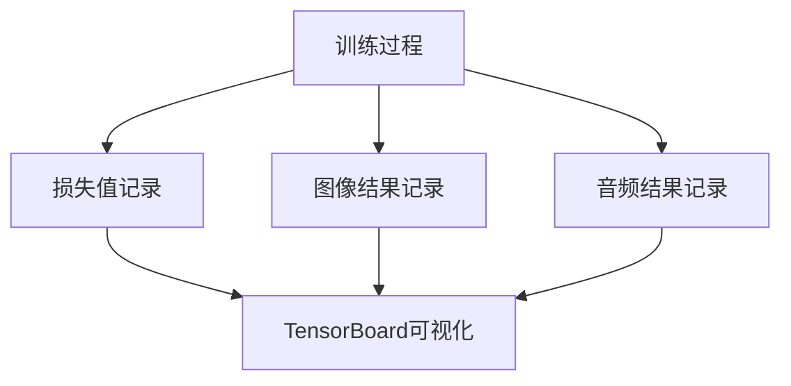
```mermaid
graph TD
    A[训练过程] --> B[损失值记录]
    A --> C[图像结果记录]
    A --> D[音频结果记录]
    B --> E[TensorBoard可视化]
    C --> E
    D --> E
```

### 与其他组件的关系

1. **训练监控**
   - 配合`DINet_mini.py`的训练过程
   - 与`html.py`的可视化功能互补
   - 支持音频驱动模型训练

2. **实验记录**
   - 记录训练进度
   - 保存实验结果
   - 支持模型调试

### 技术特点

1. **数据归一化**
```python
# 音频数据归一化
audio / max(abs(audio))
```

2. **灵活的记录方式**
   - 支持多种数据类型
   - 可选的记录项
   - 自定义标签

### 核心价值

1. **训练监控**
   - 实时损失跟踪
   - 可视化训练过程
   - 音视频结果记录

2. **开发支持**
   - 便于调试模型
   - 实验结果对比
   - 训练过程分析

这个工具函数在整个面部动画系统中扮演着训练过程监控和记录的重要角色，为模型开发和调优提供了必要的可视化和分析支持。

# `smooth.py` 文件用途

## 1. 文件概述

`smooth.py` 文件定义了一个名为 `smooth_array` 的函数，该函数用于对给定的数组进行平滑处理。这种平滑处理是通过一维卷积操作实现的，旨在减少数组中的噪声或突变，使数据更加平滑。

## 2. 主要功能

### `smooth_array` 函数

- **输入参数**：
  - `array`：一个二维数组，形状为 `[n_frames, n_values]`，其中 `n_frames` 表示帧数或时间步长，`n_values` 表示每个时间步长的值数量。
  - `weight`：一个一维数组，用作一维卷积的权重，默认为 `[0.1, 0.8, 0.1]`。这个权重数组定义了平滑操作的强度和范围。

- **输出**：
  - 函数返回一个平滑处理后的二维数组，形状仍为 `[n_frames, n_values]`。

- **处理流程**：
  1. 首先，将输入数组 `array` 转换为三维张量，形状为 `[n_frames, 1, n_values]`，以适应一维卷积的输入要求。
  2. 接着，根据权重数组 `weight` 的长度（即卷积核的大小），在输入张量的最后一个维度（时间维度）上进行填充，以确保卷积操作后输出张量的尺寸与输入张量相同。填充方式采用复制边缘值。
  3. 然后，创建一个一维卷积层 `nn.Conv1d`，并将权重数组 `weight` 设置为卷积层的权重。
  4. 对填充后的输入张量进行卷积操作，得到平滑处理后的张量。
  5. 最后，将输出张量转换回二维数组，并返回。

## 3. 使用示例

在文件的末尾，提供了一个使用示例，展示了如何加载一个包含图像信息的 pickle 文件，提取出关键点信息，并对这些关键点信息进行平滑处理。处理后的数据被保存为一个 CSV 文件。

## 4. 应用场景

该函数在需要对时间序列数据进行平滑处理时非常有用，例如在视频处理、音频信号处理或任何涉及时间序列数据的领域中。通过调整权重数组 `weight`，可以控制平滑的程度和范围，以适应不同的应用场景。

## 5. 注意事项

- 权重数组 `weight` 的长度必须是奇数，以确保卷积核的中心点明确。
函数内部使用了 `torch.no_grad()` 上下文管理器，这意味着在执行卷积操作时不会计算梯度，这对于仅需要前向传播的场景是有益的，可以减少内存消耗和计算时间。


让我分析一下`util.py`的用途，这是一个基础工具函数集合：

### 主要功能模块

1. **张量图像转换**
```python
def tensor2im(input_image, imtype=np.uint8):
    # 将PyTorch张量转换为numpy图像数组
    # 处理灰度图到RGB的转换
    # 执行后处理（转置和缩放）
```


2. **网络诊断**
```python
def diagnose_network(net, name='network'):
    # 计算网络参数梯度的平均绝对值
    # 用于监控网络训练状态
```


### 工具函数

1. **图像保存**
```python
def save_image(image_numpy, image_path, aspect_ratio=1.0):
    # 保存numpy数组为图像文件
    # 支持纵横比调整
    # 使用BICUBIC插值
```


2. **数组信息打印**
```python
def print_numpy(x, val=True, shp=False):
    # 打印数组的统计信息
    # 均值、最小值、最大值
    # 中位数和标准差
```


### 文件操作

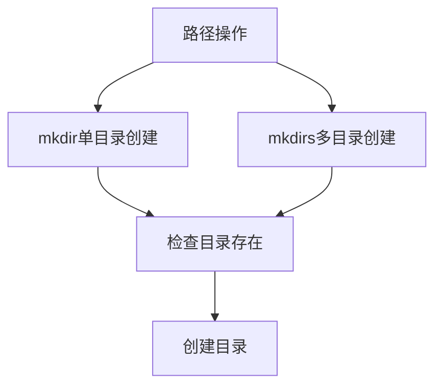
```mermaid
graph TD
    A[路径操作] --> B[mkdir单目录创建]
    A --> C[mkdirs多目录创建]
    B --> D[检查目录存在]
    C --> D
    D --> E[创建目录]
```


### 应用场景

1. **数据处理**
   - 张量和图像转换
   - 数据格式标准化
   - 图像保存和加载

2. **调试支持**
   - 网络状态监控
   - 数据统计分析
   - 目录管理

### 技术特点

1. **数据转换**
```python
# 张量处理
image_numpy = image_tensor[0].cpu().float().numpy()
# 图像格式转换
image_numpy = (np.transpose(image_numpy, (1, 2, 0)) + 1) / 2.0 * 255.0
```


2. **错误处理**
   - 类型检查
   - 路径验证
   - 安全的目录创建

### 与其他组件的关系

1. **训练支持**
   - 配合`DINet_mini.py`使用
   - 支持数据可视化
   - 辅助训练监控

2. **开发工具**
   - 与`log_board.py`配合
   - 支持`html.py`的图像处理
   - 辅助调试过程

### 核心价值

1. **开发效率**
   - 标准化的工具函数
   - 简化常见操作
   - 提高代码复用

2. **调试支持**
   - 便于问题定位
   - 支持状态监控
   - 辅助结果分析

这个工具模块提供了面部动画系统开发中常用的基础功能，是整个项目的基础支持组件。它简化了数据处理、文件操作和调试过程，提高了开发效率。

# `utils.py` 文件用途

## 1. 学习率调度器

`utils.py` 文件中的 `get_scheduler` 函数用于创建学习率调度器。该函数接收优化器、迭代次数、衰减迭代次数和学习率策略作为参数，并根据指定的策略返回相应的学习率调度器。支持的学习率策略包括：

- `lambda`：使用自定义的 lambda 函数动态调整学习率。
- `step`：按固定步长衰减学习率。
- `plateau`：当验证指标停止改进时，减少学习率。
- `cosine`：使用余弦退火策略调整学习率。

## 2. 更新学习率

`update_learning_rate` 函数用于更新学习率调度器，并打印当前的学习率。

## 3. GAN 损失函数

`GANLoss` 类实现了一个用于生成对抗网络（GAN）的损失函数。它支持标准 GAN 损失（二元交叉熵损失）和最小二乘 GAN 损失（均方误差损失）。

## 4. 人脸提取与帧处理

`ExtractFaceFromFrameList` 函数用于从视频帧列表中提取人脸，并对每帧进行裁剪和缩放，以便后续处理。该函数使用 MediaPipe 的 FaceMesh 模型来检测人脸关键点，并根据这些关键点计算人脸区域，然后裁剪和缩放每帧中的人脸部分。此外，该函数还返回了人脸关键点的 3D 坐标和裁剪后的人脸图像数组。

## 5. 总结

`utils.py` 文件提供了在训练 GAN 或其他深度学习模型时可能需要的实用工具和函数，包括学习率调度、损失函数实现以及视频帧处理。这些工具和函数旨在提高模型训练的效率和效果。


让我分析一下`visualizer.py`的用途，这是一个用于训练过程可视化的综合工具类：

### 主要功能

1. **多平台可视化支持**
```python
# 支持三种可视化方式：
- Visdom服务器可视化
- Wandb在线可视化
- HTML本地可视化
```

2. **结果展示功能**
```python
def display_current_results(self, visuals, epoch, save_result):
    # 在浏览器中显示当前结果
    # 保存结果到HTML文件
    # 支持Wandb记录
```

### 核心功能模块

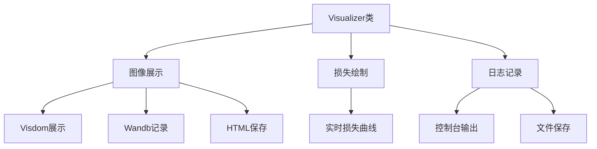
```mermaid
graph TD
    A[Visualizer类] --> B[图像展示]
    A --> C[损失绘制]
    A --> D[日志记录]
    B --> E[Visdom展示]
    B --> F[Wandb记录]
    B --> G[HTML保存]
    C --> H[实时损失曲线]
    D --> I[控制台输出]
    D --> J[文件保存]
```

### 关键特性

1. **图像处理**
```python
def save_images(webpage, visuals, image_path, ...):
    # 保存训练生成的图像
    # 支持多种格式转换
    # 自动调整大小和比例
```

2. **损失可视化**
```python
def plot_current_losses(self, epoch, counter_ratio, losses):
    # 绘制实时损失曲线
    # 支持多损失项对比
    # 自动更新显示
```

### 应用场景

1. **训练监控**
   - 实时查看训练进度
   - 监控模型性能
   - 记录实验结果

2. **结果展示**
   - 生成结果可视化
   - 实验对比分析
   - 训练过程记录

### 技术特点

1. **多平台集成**
```python
# 支持多种可视化平台
self.use_html = opt.isTrain and not opt.no_html
self.use_wandb = opt.use_wandb
```

2. **自动化管理**
```python
# 自动创建目录和文件
util.mkdirs([self.web_dir, self.img_dir])
# 自动连接服务器
self.create_visdom_connections()
```

### 与其他组件关系

1. **数据流向**
   - 接收模型输出
   - 处理训练日志
   - 生成可视化结果

2. **系统集成**
   - 与训练脚本配合
   - 支持调试过程
   - 辅助结果分析

### 核心价值

1. **训练支持**
   - 实时监控训练
   - 直观展示结果
   - 记录实验过程

2. **开发效率**
   - 快速问题定位
   - 便于结果分享
   - 支持远程监控

这个可视化工具类是整个面部动画系统中训练过程监控和结果展示的核心组件，为模型开发和调试提供了全面的可视化支持。它通过多平台集成和灵活的展示方式，大大提高了开发效率和实验分析的便利性。


让我分析一下`audio_model.py`的用途，这是一个音频到口型动画的核心处理模型：

### 主要功能

1. **音频特征提取**
```python
# 使用Kaldi特征提取
opts = knf.FbankOptions()
opts.frame_opts.frame_length_ms = 50
opts.frame_opts.frame_shift_ms = 20
opts.mel_opts.num_bins = 80
```


2. **PCA口型处理**
```python
def pca_process(x):
    # 处理口型数据的对称性
    # 将30个点的口型数据对称化
    # 确保左右对称的自然效果
```


### 核心功能模块

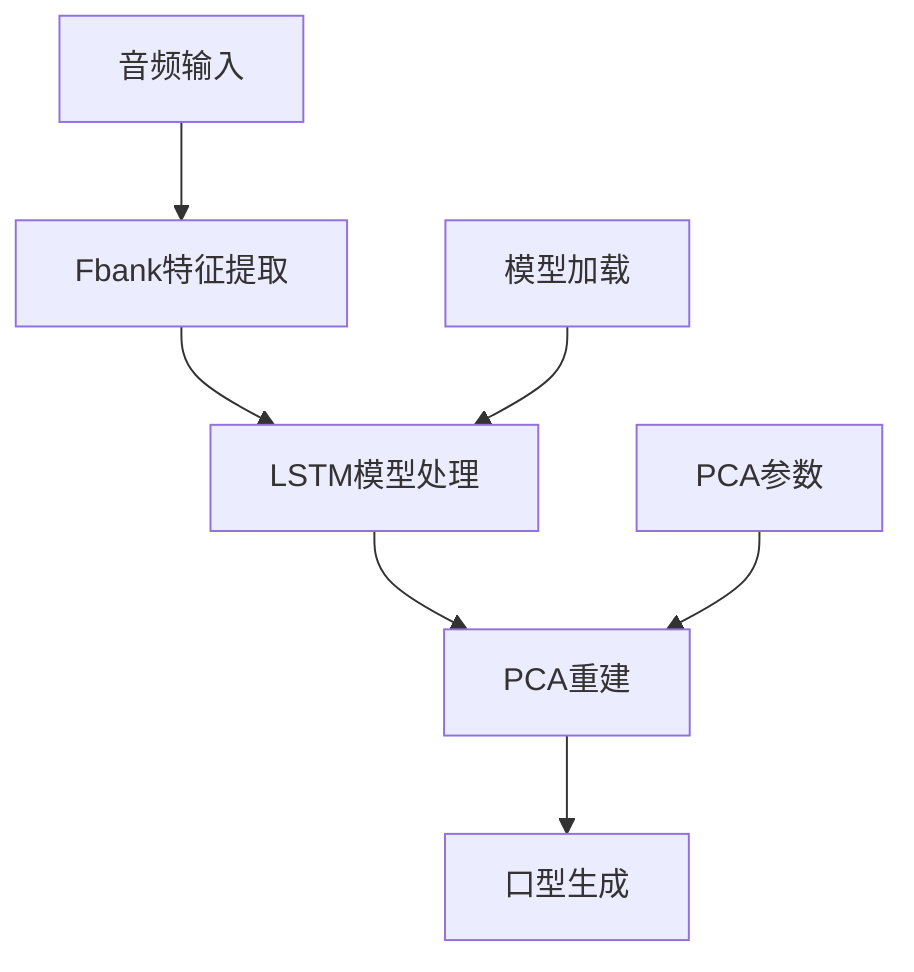
```mermaid
graph TD
    A[音频输入] --> B[Fbank特征提取]
    B --> C[LSTM模型处理]
    C --> D[PCA重建]
    D --> E[口型生成]
    F[模型加载] --> C
    G[PCA参数] --> D
```


### 关键方法

1. **实时处理接口**
```python
def interface_frame(self, audio_samples):
    # 处理实时音频帧
    # 生成对应口型
    # 返回口型图像帧
```


2. **WAV文件处理**
```python
def interface_wav(self, wavpath):
    # 处理完整WAV文件
    # 批量生成口型序列
    # 返回完整动画序列
```


### 技术特点

1. **特征处理**
   - Fbank音频特征
   - 实时特征提取
   - 帧同步处理

2. **模型架构**
   - LSTM网络
   - PCA重建
   - 对称性处理

### 应用场景

1. **实时应用**
   - 语音驱动动画
   - 实时口型生成
   - 直播应用

2. **离线处理**
   - WAV文件处理
   - 批量动画生成
   - 视频制作

### 核心数据流

1. **音频处理流程**
```python
# 音频采样 -> Fbank特征 -> LSTM预测 -> PCA重建 -> 口型图像
audio_samples -> fbank_features -> bs_array -> frame
```


2. **状态管理**
```python
# LSTM状态维护
self.h0 = torch.zeros(2, 1, 192)
self.c0 = torch.zeros(2, 1, 192)
```


### 与其他组件关系

1. **模型集成**
   - 使用`audio2bs_lstm.py`的LSTM模型
   - 配合`DINet_mini.py`的渲染
   - 支持实时推理系统

2. **数据流向**
   - 接收音频输入
   - 生成口型数据
   - 输出到渲染系统

### 核心价值

1. **实时性能**
   - 帧级处理能力
   - 状态维护机制
   - 高效特征提取

2. **质量保证**
   - PCA重建保真度
   - 对称性处理
   - 自然的口型生成

这个模型是整个面部动画系统中音频到口型转换的核心组件，通过高效的实时处理和精确的口型生成，实现了自然流畅的语音驱动面部动画效果。


# `mediapipe_utils.py` 文件用途

## 1. 文件概述

`mediapipe_utils.py` 文件包含了两个主要功能：`detect_face_mesh` 和 `detect_face`。这两个函数都利用 MediaPipe 库进行人脸检测和关键点提取。MediaPipe 是一个跨平台的框架，用于构建多媒体处理管道，特别适用于人脸、手势、物体等识别任务。

## 2. `detect_face_mesh` 函数

### 功能

`detect_face_mesh` 函数用于在提供的视频帧序列中检测人脸，并提取人脸的 468 个 3D 关键点。这些关键点可以用于后续的人脸分析、表情识别、人脸追踪等任务。

### 实现方式

- 使用 MediaPipe 的 `FaceMesh` 模型进行人脸关键点检测。
- 将输入的 BGR 格式视频帧转换为 RGB 格式，因为 MediaPipe 模型通常接受 RGB 格式的输入。
- 遍历每一帧，使用 `FaceMesh` 模型处理，并提取人脸关键点。
- 如果检测到人脸，将关键点的像素坐标（x, y, z）存储在 `pts_3d` 数组中。
- 如果在某帧中未检测到人脸，则提前终止循环。

## 3. `detect_face` 函数

### 功能

`detect_face` 函数用于在提供的视频帧序列中检测人脸，并返回检测到的人脸边界框（2D 矩形）。

### 实现方式

- 使用 MediaPipe 的 `FaceDetection` 模型进行人脸检测。
- 遍历每一帧，使用 `FaceDetection` 模型处理，并检查检测结果。
- 如果检测到人脸且只检测到一个人脸（排除多个人脸的情况），则提取人脸边界框的坐标（xmin, xmax, ymin, ymax），并存储在 `rect_2d` 数组中。
- 如果在某帧中未检测到人脸或检测到多个人脸，则提前终止循环。

## 4. 总结

`mediapipe_utils.py` 文件提供了基于 MediaPipe 的人脸检测和关键点提取功能，这对于处理涉及人脸分析的任务非常有用。通过这两个函数，用户可以轻松地在视频帧中提取人脸信息和关键点，为进一步的人脸分析、识别或追踪等任务提供基础数据。


让我分析一下`model_utils.py`的用途，这是一个模型工具函数集合，主要用于音频处理和模型加载：

### 主要功能模块

1. **模型加载功能**
```python
def LoadAudioModel(ckpt_path):
    # 加载音频到口型的LSTM模型
    from talkingface.models.audio2bs_lstm import Audio2Feature
    Audio2FeatureModel = Audio2Feature()
```

```python
def LoadRenderModel(ckpt_path, model_name = "one_ref"):
    # 加载渲染模型
    # 支持单参考和多参考两种模式
```

### 音频处理功能

1. **静音帧检测**
```python
def find_silence_frame(wav):
    # 使用能量特征检测静音帧
    # 使用滑动窗口平滑处理
    # 返回静音帧索引
```

2. **音频转换处理**
```python
def Audio2mouth(wavpath, Audio2FeatureModel, method = "lstm"):
    # WAV文件到口型特征的转换
    # Fbank特征提取
    # LSTM预测口型参数
```

### 工作流程

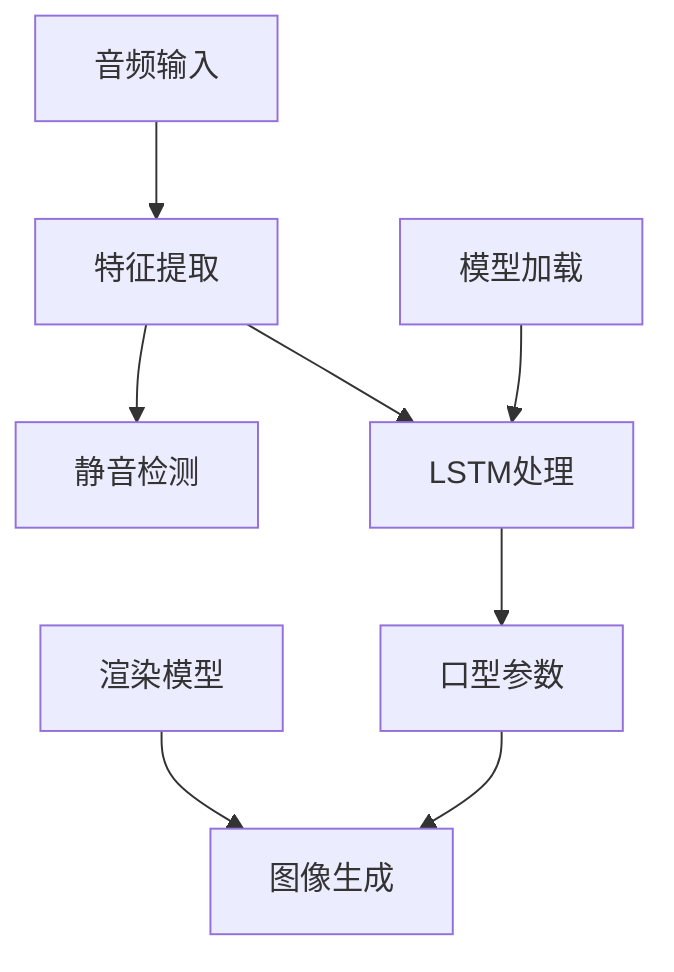
```mermaid
graph TD
    A[音频输入] --> B[特征提取]
    B --> C[静音检测]
    B --> D[LSTM处理]
    D --> E[口型参数]
    F[模型加载] --> D
    G[渲染模型] --> H[图像生成]
    E --> H
```

### 技术特点

1. **音频特征处理**
```python
# Kaldi特征提取配置
opts = knf.FbankOptions()
opts.frame_opts.frame_length_ms = 50
opts.frame_opts.frame_shift_ms = 20
opts.mel_opts.num_bins = 80
```

2. **模型灵活性**
   - 支持不同模型架构
   - 可配置参考帧数量
   - 灵活的特征提取参数

### 应用场景

1. **实时处理**
   - 音频流处理
   - 实时特征提取
   - 口型参数生成

2. **离线处理**
   - WAV文件批处理
   - 静音检测
   - 特征序列生成

### 与其他组件关系

1. **模型集成**
   - 与`audio_model.py`配合
   - 支持`DINet_mini.py`渲染
   - 辅助训练过程

2. **数据流向**
   - 音频输入处理
   - 特征提取转换
   - 模型预测输出

### 核心价值

1. **功能集成**
   - 统一的模型加载
   - 标准化的处理流程
   - 复用的工具函数

2. **处理效率**
   - 优化的特征提取
   - 高效的静音检测
   - 批量处理支持

这个工具模块在整个面部动画系统中扮演着重要的支持角色，提供了音频处理和模型加载的核心功能，是连接音频输入和动画生成的重要桥梁。

# `preprocess.py` 文件用途

## 1. 文件概述

`preprocess.py` 是一个预处理脚本，主要用于对视频文件进行处理，以准备它们用于后续的面部动画或面部替换任务。该脚本提供了多种功能，包括视频格式检查、面部关键点检测、视频反转、音频提取等。

## 2. 主要功能

### 2.1 视频格式检查 (`check_step0`)

- 验证视频是否为 MP4 格式。
- 检查视频的宽度和高度是否大于 200 像素。
- 验证视频时长是否大于 2 秒。
- 使用 FFmpeg 将视频转换为符合要求的格式，并存储在新的 MP4 文件中。

### 2.2 面部关键点检测及视频反转 (`check_step1`)

- 从转换后的视频中提取面部关键点。
- 使用 MediaPipe 的面部检测模型检测面部边界框。
- 对原始视频进行反转，以创建循环视频效果。
- 使用 FFmpeg 将原始视频和反转视频拼接成一个新的视频文件。
- 提取视频的第一帧作为预览图像。

### 2.3 音频提取 (`check_step0_audio`)

- 使用 FFmpeg 从视频中提取音频，并将其保存为 WAV 文件。

### 2.4 视频处理函数 (`ExtractFromVideo`)

- 读取视频帧，使用 MediaPipe 的面部网格模型检测面部关键点。
- 处理面部关键点数据，包括标准化和保存为二进制文件。

### 2.5 新任务处理 (`new_task`)

- 根据任务模式（演员视频或音频提取）调用相应的处理函数。
- 打印处理日志，包括任务 ID、进度、状态和错误信息。

## 3. 使用场景

该脚本主要用于准备演员视频和音频数据，以便在面部动画或面部替换任务中使用。通过预处理步骤，可以确保视频和音频数据符合后续处理的要求，并提高整体处理效率和准确性。

## 4. 注意事项

- 在使用脚本之前，请确保已安装所需的库和工具，如 OpenCV、FFmpeg 和 MediaPipe。
- 根据实际需求调整脚本中的参数和路径设置。
脚本中的处理步骤可能需要根据具体任务进行调整和优化。


让我分析一下`render_model_mini.py`的用途，这是一个用于面部渲染的精简模型实现：

### 主要功能

1. **模型管理**
```python
def loadModel(self, ckpt_path):
    # 加载DINet迷你版本
    # 支持3个参考帧
    # 配置输入输出通道
```


2. **角色重置**
```python
def reset_charactor(self, img_list, driven_keypoints, standard_size = 256):
    # 选择合适的参考帧
    # 生成口型特征图
    # 准备渲染参考数据
```


### 工作流程

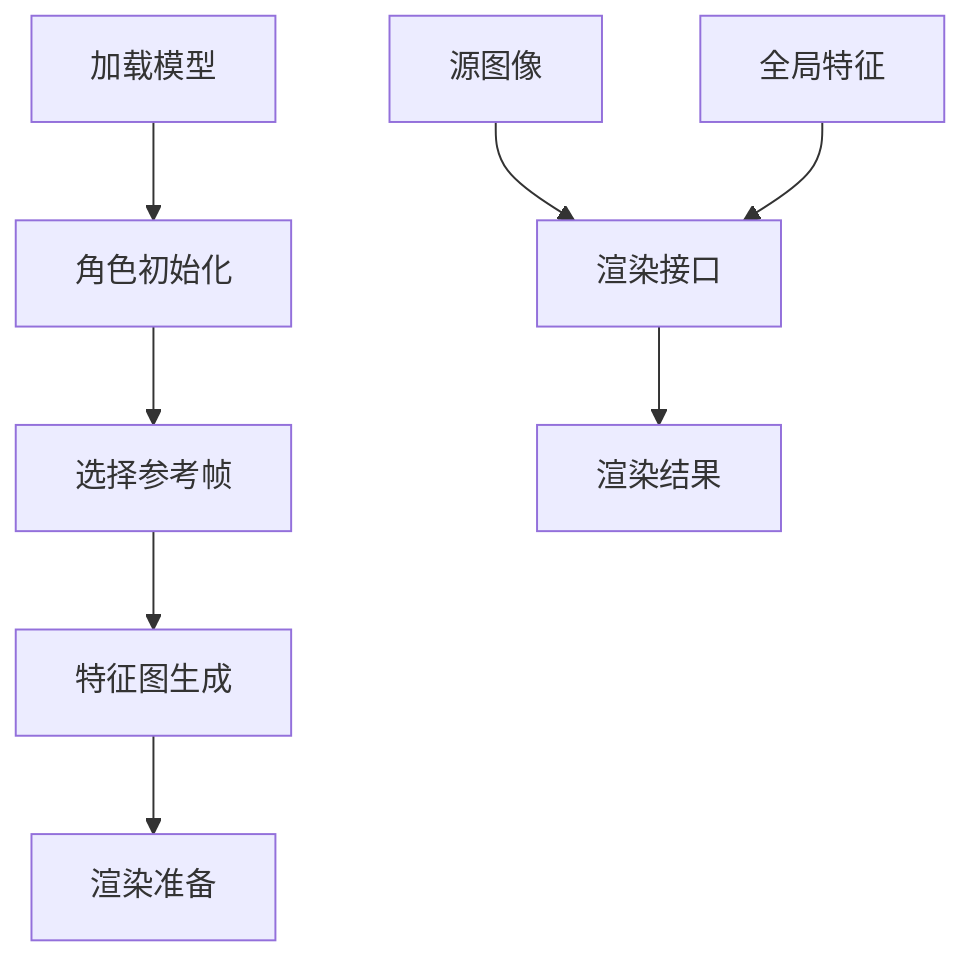
```mermaid
graph TD
    A[加载模型] --> B[角色初始化]
    B --> C[选择参考帧]
    C --> D[特征图生成]
    D --> E[渲染准备]
    F[源图像] --> G[渲染接口]
    H[全局特征] --> G
    G --> I[渲染结果]
```


### 核心功能模块

1. **渲染接口**
```python
def interface(self, source_tensor, gl_tensor):
    # 处理源图像和全局特征
    # 生成渲染结果
    # 返回变形后的图像
```


2. **参考帧处理**
```python
# 参考帧选择和处理
ref_img_index_list = select_ref_index(driven_keypoints, n_ref=3, ratio=0.33)
ref_face_edge = draw_mouth_maps(driven_keypoints[i])
```


### 技术特点

1. **图像处理**
   - 支持尺寸调整
   - 特征图生成
   - 边缘检测

2. **模型配置**
```python
# 模型参数设置
n_ref = 3                # 参考帧数量
source_channel = 3       # 源图像通道
ref_channel = n_ref * 4  # 参考特征通道
```


### 应用场景

1. **实时渲染**
   - 面部动画生成
   - 表情迁移
   - 口型同步

2. **批量处理**
   - 视频生成
   - 动画制作
   - 表情编辑

### 与其他组件关系

1. **数据流向**
   - 接收`audio_model.py`的口型参数
   - 使用`utils.py`的工具函数
   - 输出到渲染系统

2. **模型集成**
   - 与`DINet_mini.py`配合
   - 支持实时推理
   - 提供渲染接口

### 核心价值

1. **渲染质量**
   - 高质量面部生成
   - 自然的表情迁移
   - 流畅的动画效果

2. **系统集成**
   - 标准化接口
   - 灵活的配置
   - 高效的处理

### 实现细节

1. **图像预处理**
```python
# 图像裁剪和缩放
w_pad = int((128 - 72) / 2)
h_pad = int((128 - 56) / 2)
ref_img = ref_img[h_pad:-h_pad, w_pad:-w_pad,:3]
```


2. **特征融合**
```python
# 特征图和图像融合
ref_img = np.concatenate([ref_img, ref_face_edge[:, :, :1]], axis=2)
```


这个模型是整个面部动画系统中的渲染核心，通过精简的设计和高效的实现，提供了高质量的面部动画渲染能力。它与音频处理和特征提取模块紧密配合，实现了完整的语音驱动面部动画功能。

# `render_model.py` 文件用途

## 1. 文件概述

`render_model.py` 文件定义了一个名为 `RenderModel` 的类，该类主要用于实现面部动画或面部替换的功能。通过加载预训练的模型，该类能够将源视频中的人脸与参考图像中的人脸进行融合，特别是替换掉源视频中的人嘴部分，从而实现“说话”的效果。

## 2. 主要功能

### 2.1 加载模型 (`loadModel` 方法)

- 该方法用于加载预训练的 `DINet` 模型，该模型专门用于面部动画或替换任务。
- 加载的模型将被存储在类的实例变量中，以便后续使用。

### 2.2 重置角色 (`reset_charactor` 方法)

- 该方法用于准备视频数据和参考图像，以便进行面部动画或替换。
- 它从指定的视频路径和 pickle 文件中提取关键点信息和参考图像，并将这些数据存储在类的实例变量中。
- 同时，该方法还会根据参考图像中的人脸关键点信息，计算出嘴巴区域的坐标范围，以便后续进行嘴巴替换。

### 2.3 接口函数 (`interface` 方法)

- 该方法是 `RenderModel` 类的核心功能，它接受一帧源视频图像和一张嘴巴图像作为输入。
- 方法内部首先根据当前帧索引和视频总帧数来确定是否需要重置视频帧索引。
- 然后，它根据当前帧的关键点信息和嘴巴图像，生成输入数据，并通过加载的模型进行面部动画或替换。
- 最后，将处理后的图像与源视频帧进行融合，并返回融合后的视频帧。

### 2.4 保存模型 (`save` 方法)

- 该方法用于将加载的模型状态保存到指定的路径中。
- 这允许用户在需要时重新加载模型状态，而无需重新训练模型。

## 3. 使用场景

- `render_model.py` 文件主要用于面部动画或面部替换任务中，特别是在实现“说话人脸”或类似效果时非常有用。
- 用户可以通过加载预训练的模型、准备视频数据和参考图像，然后使用 `interface` 方法逐帧处理视频，从而实现面部动画或替换效果。

## 4. 注意事项

- 在使用 `RenderModel` 类之前，请确保已经准备好了预训练的模型和相应的视频数据及参考图像。
- 根据实际需求调整模型的输入尺寸、输出尺寸以及关键点的索引等参数。
由于该类依赖于 GPU 进行加速计算，因此请确保您的机器上安装了 CUDA 兼容的 GPU，并且已经正确安装了 PyTorch 和其他必要的依赖库。


让我分析一下`run_utils.py`的用途，这是一个面部动画系统的核心运行工具集：

### 主要功能模块

1. **面部矩阵计算**
```python
def calc_face_mat(pts_array_origin, face_pts_mean):
    # 计算面部变换矩阵
    # 执行PCA降维
    # 平滑处理变换矩阵
```


2. **视频点处理**
```python
def video_pts_process(pts_array_origin):
    # 处理视频关键点
    # 生成面部遮罩
    # 计算标准化点
```


### 核心处理流程

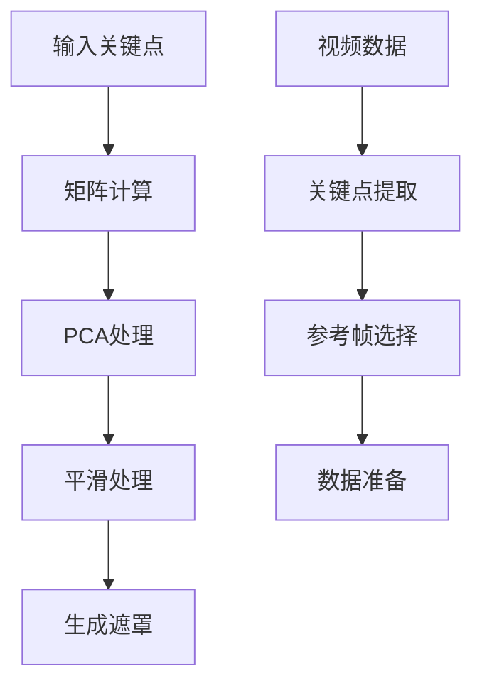
```mermaid
graph TD
    A[输入关键点] --> B[矩阵计算]
    B --> C[PCA处理]
    C --> D[平滑处理]
    D --> E[生成遮罩]
    F[视频数据] --> G[关键点提取]
    G --> H[参考帧选择]
    H --> I[数据准备]
```


### 关键功能

1. **矩阵校正**
```python
def correct_rotation_matrix(R):
    # SVD分解
    # 确保行列式为1
    # 避免反射变换
```


2. **数据准备**
```python
def prepare_video_data(video_path, Path_pkl, ref_img_index_list, ...):
    # 加载关键点数据
    # 平滑处理
    # 生成参考图像
```


### 技术特点

1. **数据处理**
   - PCA降维
   - 矩阵平滑
   - 关键点标准化

2. **特征提取**
   - 面部遮罩生成
   - 参考帧选择
   - 数据格式转换

### 应用场景

1. **预处理阶段**
   - 视频数据准备
   - 关键点处理
   - 参考帧生成

2. **运行时处理**
   - 实时矩阵计算
   - 遮罩生成
   - 数据转换

### 与其他组件关系

1. **数据流向**
   - 为`render_model_mini.py`提供数据
   - 与`audio_model.py`配合
   - 支持实时渲染

2. **处理支持**
   - 提供数据预处理
   - 支持模型推理
   - 辅助渲染过程

### 核心价值

1. **数据质量**
   - 确保变换准确性
   - 提供平滑处理
   - 保证数据一致性

2. **处理效率**
   - 优化计算流程
   - 提供批处理能力
   - 支持实时处理

### 实现细节

1. **PCA处理**
```python
n_components = min(25, len(pts_array_origin)//20)
pca = decomposition.PCA(n_components=n_components)
pca.fit(x)
```


2. **数据连接**
```python
def concat_output_2binfile(mat_list, pts_3d, ...):
    # 连接多种数据
    # 格式化输出
    # 类型转换
```


这个工具模块是整个面部动画系统的核心运行支持组件，提供了从数据预处理到实时运行的全面支持，确保了系统的稳定运行和高质量输出。


让我分析一下`utils.py`的用途，这是一个面部特征处理的核心工具文件：

### 主要功能模块

1. **关键点索引定义**
```python
# 定义面部各区域关键点索引
INDEX_LEFT_EYEBROW = [276, 283, ...]  # 左眉毛
INDEX_RIGHT_EYEBROW = [46, 53, ...]   # 右眉毛
INDEX_NOSE = [...]                    # 鼻子
INDEX_LIPS = [...]                    # 嘴唇
```


2. **裁剪功能**
```python
def crop_face(keypoints, is_train=False, size=[512, 512]):
    # 根据关键点裁剪面部区域
    # 支持训练时的随机偏移
```


### 核心处理功能

1. **特征图生成**
```python
def draw_face_feature_maps(keypoints, mode=["mouth", "nose", "eye", "oval"], ...):
    # 绘制面部特征图
    # 支持多种特征模式
    # 处理不同面部区域
```


2. **平滑处理**
```python
def smooth_array(array, weight=[0.1,0.8,0.1], mode="numpy"):
    # 数据平滑处理
    # 支持numpy和torch两种模式
    # 使用卷积实现平滑
```


### 工作流程

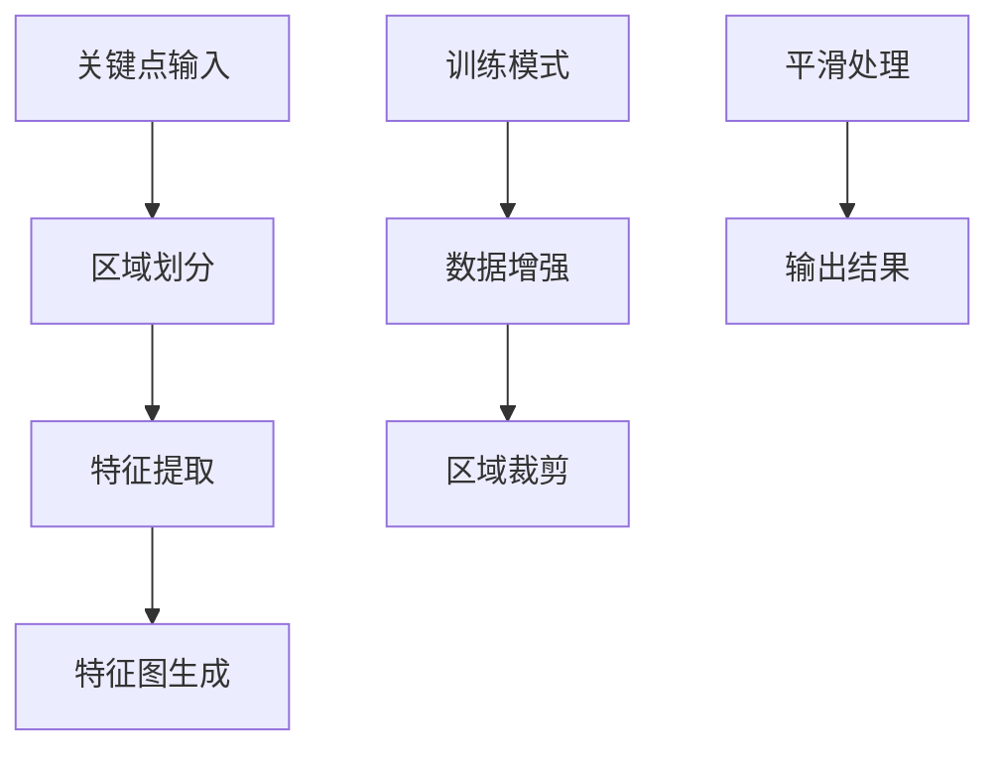
```mermaid
graph TD
    A[关键点输入] --> B[区域划分]
    B --> C[特征提取]
    C --> D[特征图生成]
    E[训练模式] --> F[数据增强]
    F --> G[区域裁剪]
    H[平滑处理] --> I[输出结果]
```


### 技术特点

1. **面部区域处理**
   - 精确的区域划分
   - 灵活的特征提取
   - 多模式支持

2. **数据处理**
   - 平滑算法
   - 旋转变换
   - 特征图生成

### 应用场景

1. **预处理阶段**
   - 关键点提取
   - 区域划分
   - 特征图生成

2. **训练支持**
   - 数据增强
   - 特征提取
   - 平滑处理

### 核心功能

1. **面部特征处理**
```python
# 嘴部区域裁剪
def crop_mouth(pts_array_origin, img_w, img_h, is_train=False):
    # 计算嘴部中心
    # 确定裁剪区域
    # 支持训练时增强
```


2. **特征图绘制**
```python
def draw_mouth_maps(keypoints, size=(256, 256), im_edges=None):
    # 绘制嘴部特征图
    # 区分上下唇
    # 生成边缘图
```


### 与其他组件关系

1. **数据流向**
   - 为`render_model_mini.py`提供特征
   - 支持`audio_model.py`的处理
   - 辅助训练过程

2. **功能支持**
   - 提供基础工具函数
   - 支持数据预处理
   - 辅助模型训练

### 核心价值

1. **数据质量**
   - 精确的特征提取
   - 可靠的数据处理
   - 稳定的增强效果

2. **开发支持**
   - 完整的工具集
   - 灵活的接口
   - 可扩展的设计

这个工具文件是整个面部动画系统的基础支持组件，提供了从关键点处理到特征图生成的全面功能支持，是确保系统高质量输出的关键模块。

# `train/data_preparation_face.py` 文件用途

## 1. 文件概述

`train/data_preparation_face.py` 文件是一个用于准备面部动画或面部替换任务所需数据的脚本。它主要执行以下任务：从视频中提取面部关键点、计算面部变换矩阵、生成标准化后的面部关键点数据，并将这些数据保存到文件中，以便后续训练或推理使用。

## 2. 主要功能

### 2.1 面部检测与关键点提取

- 使用 MediaPipe 的面部检测（`mp_face_detection`）和面部网格（`mp_face_mesh`）模型从视频帧中提取面部关键点和边界框。
- 对检测到的面部进行筛选，剔除掉多个人脸、大角度侧脸、部分人脸框在画面外或人脸像素过低的帧。

### 2.2 面部关键点处理

- 对提取到的面部关键点进行平滑处理，以减少噪声。
- 计算面部变换矩阵，将面部关键点从原始坐标系转换到标准化坐标系中。
- 根据标准化后的面部关键点，计算个性化的面部平均关键点位置，用于后续处理。

### 2.3 数据保存

- 将处理后的面部关键点数据保存到 pickle 文件中，以便后续使用。
- 使用 FFmpeg 从原始视频中裁剪出包含人脸的区域，并将其保存为 PNG 图像文件。
- 将面部变换矩阵和个性化的面部平均关键点位置也保存到 pickle 文件中。

## 3. 使用场景

- 该脚本主要用于准备面部动画或面部替换任务的数据集。
- 通过提取和处理视频中的面部关键点数据，可以为后续的模型训练或推理提供必要的输入。

## 4. 注意事项

- 在使用脚本之前，请确保已经安装了必要的依赖库，如 MediaPipe、OpenCV、FFmpeg 和 NumPy。
- 脚本中的参数（如面部关键点索引、平滑参数等）可能需要根据具体任务进行调整。
- 处理后的数据将被保存到与原始视频相同的目录下，并以视频文件名作为前缀命名。

## 5. 执行方式

- 通过命令行运行脚本，并传入包含视频文件的目录作为参数。
脚本将遍历目录中的每个视频文件，对它们进行处理，并将结果保存到相应的目录中。

让我分析一下`train_input_validation_render_model.py`的用途，这是一个用于验证训练数据输入的脚本：

### 主要功能

1. **数据加载和验证**
```python
# 加载训练数据集
dict_info = data_preparation(video_list)
test_set = Few_Shot_Dataset(dict_info, is_train=True, n_ref=1)
```

2. **可视化检查**
```python
# 将张量转换为可视化图像
def Tensor2img(tensor_, channel_index):
    frame = tensor_[...].detach().squeeze(0).cpu().float().numpy()
    return frame.astype(np.uint8)
```

### 工作流程

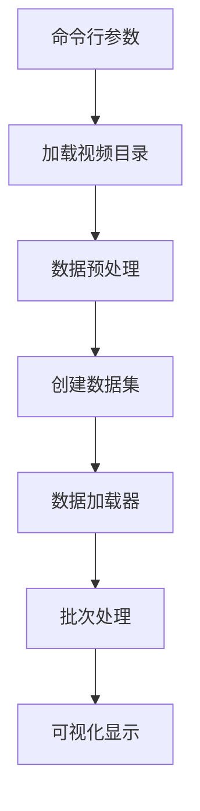
```mermaid
graph TD
    A[命令行参数] --> B[加载视频目录]
    B --> C[数据预处理]
    C --> D[创建数据集]
    D --> E[数据加载器]
    E --> F[批次处理]
    F --> G[可视化显示]
```

### 核心功能

1. **数据验证**
   - 检查数据格式
   - 验证张量维度
   - 确认数据对齐

2. **可视化展示**
   - 显示源图像
   - 显示参考图像
   - 显示目标图像

### 应用场景

1. **训练准备**
   - 验证数据预处理
   - 检查数据质量
   - 确认数据格式

2. **调试支持**
   - 可视化检查
   - 数据流验证
   - 问题定位

### 技术特点

1. **命令行接口**
```python
if len(sys.argv) != 2:
    print("Usage: python train_input_validation_render_model.py <data_dir>")
    sys.exit(1)
```

2. **数据处理**
```python
# 数据加载和批处理
testing_data_loader = DataLoader(dataset=test_set, 
                                num_workers=0, 
                                batch_size=1, 
                                shuffle=False)
```

### 与其他组件关系

1. **数据流向**
   - 使用`Few_Shot_Dataset`类
   - 配合`data_preparation`函数
   - 支持训练流程

2. **开发支持**
   - 辅助模型训练
   - 支持数据验证
   - 提供调试工具

### 核心价值

1. **质量保证**
   - 验证数据完整性
   - 确保数据格式
   - 支持可视化检查

2. **开发效率**
   - 快速问题定位
   - 直观结果展示
   - 便于调试验证

这个脚本在训练流程中扮演着数据验证和调试的重要角色，通过可视化方式帮助开发者确保训练数据的质量和正确性。

# `train/train_render_model.py` 文件用途

## 1. 文件概述

`train/train_render_model.py` 文件是一个用于训练面部动画或面部替换模型的脚本。它使用 PyTorch 框架来实现模型的训练过程，包括数据加载、模型定义、损失函数计算、优化器更新等步骤。

## 2. 主要功能

### 2.1 数据加载与预处理

- 脚本通过定义 `Few_Shot_Dataset` 类来加载训练数据。这个类负责从指定的视频列表中读取数据，并对数据进行预处理，包括提取源图像、参考图像和目标图像等。
- 数据预处理部分还包括了数据的增强和标准化，以确保模型能够泛化到未见过的数据上。

### 2.2 模型定义

- 脚本中定义了三个主要的神经网络模型：生成器（`DINet_five_Ref`）、判别器（`Discriminator`）和感知损失网络（`Vgg19`）。
- 生成器负责将源图像和参考图像转换为目标图像；判别器用于区分真实图像和生成图像；感知损失网络用于计算生成图像和真实图像在特征空间中的差异。

### 2.3 训练过程

- 训练过程包括多个步骤，如数据加载、模型前向传播、损失计算、反向传播和参数更新等。
- 脚本使用了对抗性损失（GAN Loss）和感知损失（Perception Loss）来训练生成器，以使其生成的图像既逼真又与目标图像相似。
- 同时，还使用了学习率调度器来动态调整学习率，以提高训练效果。

### 2.4 日志记录与模型保存

- 脚本使用 TensorBoard 来记录训练过程中的各种指标，如损失值、学习率等，以便进行可视化和分析。
- 在每个训练周期结束时，脚本会将当前模型的状态保存到磁盘上，以便在需要时恢复训练或进行推理。

## 3. 使用场景

- 该脚本主要用于训练面部动画或面部替换模型。通过调整模型结构和训练参数，可以生成具有不同风格和表情的面部图像。
- 训练好的模型可以用于各种应用场景，如虚拟主播、视频编辑、游戏开发等。

## 4. 注意事项

- 在使用脚本之前，请确保已经安装了所有必要的依赖项，并配置了正确的环境变量。
- 根据实际需求调整模型结构、训练参数和数据预处理方式等。
训练过程可能需要较长的时间，请确保有足够的计算资源和耐心等待训练完成。


让我分析一下`conv.py`的用途，这是一个定义基础卷积模块的文件：

### 主要组件

1. **标准卷积模块 (Conv2d)**
```python
class Conv2d(nn.Module):
    # 包含标准化和激活函数的卷积层
    self.conv_block = nn.Sequential(
        nn.Conv2d(cin, cout, kernel_size, stride, padding),
        nn.BatchNorm2d(cout)
    )
    self.act = nn.ReLU()
```

2. **无标准化卷积模块 (nonorm_Conv2d)**
```python
class nonorm_Conv2d(nn.Module):
    # 不包含标准化的卷积层
    # 使用LeakyReLU激活
    self.act = nn.LeakyReLU(0.01, inplace=True)
```

3. **转置卷积模块 (Conv2dTranspose)**
```python
class Conv2dTranspose(nn.Module):
    # 上采样用的转置卷积
    # 包含标准化和ReLU激活
```

### 技术特点

```mermaid
graph TD
    A[输入特征] --> B[卷积操作]
    B --> C[批标准化]
    C --> D[激活函数]
    D --> E[输出特征]
    F[残差连接] -.-> E
```

### 应用场景

1. **特征提取**
   - 音频特征处理
   - 空间特征提取
   - 多尺度分析

2. **上采样处理**
   - 特征图重建
   - 分辨率提升
   - 细节恢复

### 核心特性

1. **模块化设计**
   - 标准化选项
   - 残差连接支持
   - 灵活的激活函数

2. **处理选项**
   - 标准卷积处理
   - 无标准化处理
   - 转置卷积处理

### 与其他组件关系

1. **模型集成**
   - 支持音频处理模型
   - 配合特征提取
   - 辅助生成网络

2. **数据流向**
   - 处理输入特征
   - 生成中间表示
   - 输出处理结果

### 核心价值

1. **功能封装**
   - 标准化的接口
   - 复用的模块
   - 灵活的配置

2. **性能优化**
   - 残差学习
   - 特征正则化
   - 非线性变换

这个文件提供了音频处理和特征提取所需的基础卷积模块，是整个系统中神经网络构建的基础组件。通过模块化设计和灵活的配置选项，支持了不同场景下的特征处理需求。


# `train_audio/models/syncnet.py` 文件用途

## 1. 文件概述

`train_audio/models/syncnet.py` 文件定义了一个名为 `SyncNet_color` 的神经网络模型，该模型主要用于实现音频与视频帧之间的同步。该模型由两部分组成：面部编码器（`face_encoder`）和音频编码器（`audio_encoder`），分别用于处理视频帧和音频序列，以提取它们的嵌入表示。

## 2. 主要功能

### 2.1 面部编码器（`face_encoder`）

- **输入**：接收形状为 `(B, 15, H, W)` 的视频帧序列，其中 `B` 是批次大小，`15` 是视频帧的通道数（可能包括灰度图像和额外的通道，如光流等），`H` 和 `W` 分别是视频帧的高度和宽度。
- **结构**：由多个卷积层组成，逐渐减小特征图的尺寸并增加通道数，同时通过残差连接来保持信息的流动。
- **输出**：输出面部嵌入表示，形状为 `(B, D)`，其中 `D` 是嵌入表示的维度。

### 2.2 音频编码器（`audio_encoder`）

- **输入**：接收形状为 `(B, 1, T, F)` 的音频序列，其中 `B` 是批次大小，`1` 是音频序列的通道数，`T` 是时间步数，`F` 是特征维度（例如，梅尔频谱的频点数）。
- **结构**：同样由多个卷积层组成，用于提取音频序列的特征。与面部编码器不同的是，音频编码器中的卷积层在时间维度上进行了下采样，以匹配视频帧的帧率。
- **输出**：输出音频嵌入表示，形状同样为 `(B, D)`。

### 2.3 前向传播（`forward` 方法）

- 该方法接收音频序列和面部序列作为输入，分别通过音频编码器和面部编码器进行处理。
- 提取的音频和面部嵌入表示随后被展平并归一化，以确保它们具有单位范数。
- 归一化后的嵌入表示可以用于计算音频和面部之间的相似度，从而实现音频与视频的同步。

## 3. 使用场景

- 该模型可以用于实现基于音频的视频同步，例如，在视频编辑或制作中，使视频中的口型与音频中的语音完美匹配。
- 它还可以用于语音驱动的面部动画，其中音频信号被用来驱动虚拟角色的面部表情和口型动作。

## 4. 注意事项

- 在使用模型之前，需要确保输入数据的格式和维度与模型期望的输入相匹配。
- 模型的性能可能受到训练数据的质量和数量的影响，因此需要使用大规模的、标注良好的训练数据集进行训练。
模型的结构和参数可能需要根据具体的应用场景进行调整和优化。


让我分析一下`wav2lip.py`的用途，这是一个音频驱动的唇形合成模型：

### 主要组件

1. **Wav2Lip生成器**
```python
class Wav2Lip(nn.Module):
    # 包含三个主要部分：
    self.face_encoder_blocks  # 面部特征编码器
    self.audio_encoder       # 音频特征编码器
    self.face_decoder_blocks # 面部特征解码器
```

2. **判别器**
```python
class Wav2Lip_disc_qual(nn.Module):
    # 质量判别器
    # 主要关注下半脸区域
    # 用于评估生成结果的真实性
```

### 网络架构

```mermaid
graph TD
    A[音频序列] --> B[音频编码器]
    C[面部序列] --> D[面部编码器]
    B --> E[特征融合]
    D --> E
    E --> F[面部解码器]
    F --> G[输出块]
    G --> H[生成结果]
```

### 核心功能

1. **特征提取和编码**
```python
# 音频编码
audio_embedding = self.audio_encoder(audio_sequences)

# 面部编码
for f in self.face_encoder_blocks:
    x = f(x)
    feats.append(x)
```

2. **特征解码和生成**
```python
# 特征解码和跳跃连接
for f in self.face_decoder_blocks:
    x = f(x)
    x = torch.cat((x, feats[-1]), dim=1)
```

### 技术特点

1. **多尺度处理**
   - 逐步下采样和上采样
   - 跳跃连接保留细节
   - 残差学习

2. **特征融合**
   - 音频和视觉特征融合
   - 多层级特征整合
   - 渐进式生成

### 应用场景

1. **语音驱动动画**
   - 口型同步
   - 表情生成
   - 视频合成

2. **质量控制**
   - 真实性评估
   - 细节优化
   - 同步性保证

### 核心价值

1. **生成质量**
   - 高质量口型生成
   - 自然的运动过渡
   - 准确的音视频同步

2. **实用性能**
   - 端到端训练
   - 稳定的生成效果
   - 可控的质量评估

### 实现细节

1. **网络结构**
```python
# 编码器-解码器架构
# 使用残差连接
# 多层级特征提取
```

2. **判别器设计**
```python
# 专注于下半脸区域
# 二分类预测
# 感知损失计算
```

这个模型是整个系统中音频到口型生成的核心组件，通过深度学习技术实现了高质量的语音驱动面部动画生成。它的设计充分考虑了特征提取、融合和生成的各个环节，确保了生成结果的质量和真实性。
# `train_audio/audio.py` 文件用途

## 1. 文件概述

`train_audio/audio.py` 文件是一个音频处理工具集，提供了一系列用于音频加载、保存、预处理和特征提取的函数。这些功能在处理音频数据、进行音频分析以及音频与视频同步等任务中非常有用。

## 2. 主要功能

### 2.1 音频加载与保存

- `load_wav(path, sr)`: 从指定路径加载WAV格式的音频文件，并重新采样到指定的采样率（`sr`）。
- `save_wav(wav, path, sr)`: 将处理后的音频数据保存为WAV格式的文件，并指定采样率。
- `save_wavenet_wav(wav, path, sr)`: 使用librosa库将音频数据保存为WAV格式的文件。

### 2.2 音频预处理

- `preemphasis(wav, k, preemphasize=True)`: 对音频信号进行预加重处理，以增强高频成分。
- `inv_preemphasis(wav, k, inv_preemphasize=True)`: 对预加重处理后的音频信号进行逆预加重处理，以恢复原始信号。

### 2.3 音频特征提取

- `linearspectrogram(wav)`: 计算音频信号的线性频谱图。
- `melspectrogram(wav)`: 计算音频信号的梅尔频谱图，这是音频处理中常用的特征表示方法。
- `_stft(y)`: 计算音频信号的短时傅里叶变换（STFT），用于频谱图计算。
- `_lws_processor()`: 初始化Librosa-like STFT处理器，用于更高效的STFT计算。

### 2.4 辅助函数

- `get_hop_size()`: 根据帧移（`frame_shift_ms`）或给定的跳跃大小（`hop_size`）计算STFT的跳跃大小。
- `num_frames(length, fsize, fshift)`: 计算给定音频信号长度的频谱图帧数。
- `pad_lr(x, fsize, fshift)`: 计算音频信号在左右两侧的填充大小，以确保频谱图帧数的完整性。
- `librosa_pad_lr(x, fsize, fshift)`: 使用Librosa的填充策略计算填充大小。

### 2.5 频谱图处理

- `_linear_to_mel(spectogram)`: 将线性频谱图转换为梅尔频谱图。
- `_build_mel_basis()`: 构建梅尔滤波器组的基础矩阵。
- `_amp_to_db(x)`: 将振幅转换为分贝（dB）单位。
- `_db_to_amp(x)`: 将分贝单位转换为振幅。
- `_normalize(S)`: 对频谱图进行归一化处理。
- `_denormalize(D)`: 对归一化后的频谱图进行反归一化处理。

## 3. 使用场景

- **音频分析**：提取音频特征（如梅尔频谱图）进行进一步的分析或建模。
- **音频合成**：根据提取的音频特征生成新的音频信号。
- **音频与视频同步**：通过提取音频和视频的特征，实现它们之间的同步。
- **语音识别和合成**：在语音识别和文本到语音（TTS）系统中，音频预处理和特征提取是关键步骤。

## 4. 注意事项

- 在使用这些函数之前，请确保已经安装了必要的依赖库，如`librosa`和`numpy`。
- 函数的参数可能需要根据具体任务进行调整，例如采样率（`sr`）、预加重系数（`k`）等。
频谱图的计算和归一化处理可能会受到超参数（如`hp.min_level_db`、`hp.max_abs_value`等）的影响，这些超参数需要根据实际情况进行调优。


让我分析一下`hparams.py`的用途，这是一个音频处理和训练的超参数配置文件：

### 主要功能

1. **参数管理类**
```python
class HParams:
    # 超参数管理类
    # 支持动态设置和获取
    # 提供参数验证
```


2. **音频处理参数**
```python
# 音频预处理参数
num_mels = 80          # 梅尔频谱图通道数
n_fft = 800           # FFT窗口大小
hop_size = 200        # 帧移
sample_rate = 16000   # 采样率
```


### 参数类别

```mermaid
graph TD
    A[超参数配置] --> B[音频处理参数]
    A --> C[训练参数]
    A --> D[模型参数]
    B --> E[频谱图参数]
    B --> F[信号处理参数]
    C --> G[优化器参数]
    C --> H[训练控制参数]
```


### 核心参数组

1. **音频预处理参数**
   - 梅尔频谱图配置
   - 信号归一化
   - 频率范围设置

2. **训练控制参数**
```python
batch_size = 16
initial_learning_rate = 1e-4
nepochs = 2e17
checkpoint_interval = 3000
```


### 特殊功能

1. **文件列表获取**
```python
def get_image_list(data_root, split):
    # 读取训练/验证数据列表
    # 支持路径拼接
```


2. **参数验证**
```python
def __getattr__(self, key):
    # 参数存在性检查
    # 提供错误提示
```


### 关键参数设置

1. **音频处理**
```python
# 频谱图参数
signal_normalization = True
preemphasize = True
preemphasis = 0.97
```


2. **训练控制**
```python
# 损失权重
syncnet_wt = 0.0  # 自动设置为0.03
disc_wt = 0.07
```


### 应用场景

1. **预处理配置**
   - 音频特征提取
   - 信号预处理
   - 频谱图生成

2. **训练配置**
   - 批次大小设置
   - 学习率控制
   - 检查点保存

### 与其他组件关系

1. **数据处理**
   - 配合`audio.py`使用
   - 支持`wav2lip.py`模型
   - 指导预处理流程

2. **训练控制**
   - 指导训练过程
   - 配置模型参数
   - 控制评估周期

### 核心价值

1. **参数管理**
   - 集中配置管理
   - 灵活的参数调整
   - 统一的访问接口

2. **实验支持**
   - 便于参数调优
   - 支持实验对比
   - 配置复用

这个配置文件是整个音频处理和训练系统的核心配置组件，通过统一的参数管理，确保了系统各个组件的协调工作和实验的可重复性。

# `train_audio/preparation_step0.py` 文件用途

## 1. 文件概述

`train_audio/preparation_step0.py` 文件是一个用于处理音频和视频数据的脚本，它结合了音频处理、面部检测和视频生成的功能。该脚本的主要目的是将给定的音频文件（如语音）与静态面部图像结合，生成一系列视频帧，其中面部的口型与音频中的语音同步。

## 2. 主要功能

### 2.1 加载模型

- 脚本使用 `Wav2Lip` 模型，这是一个用于实现“语音到唇部同步”的深度学习模型。模型通过加载预训练的权重来初始化。

### 2.2 音频处理

- 使用 `audio.load_wav` 函数加载音频文件，并将其转换为模型所需的格式。
- 使用 `audio.melspectrogram` 函数计算音频的梅尔频谱图，这是模型输入的一部分。
- 将梅尔频谱图分割成多个小块，以便与视频帧对应。

### 2.3 面部检测与处理

- 使用 `face_detect` 函数从静态图像中检测面部，并裁剪和缩放面部区域到固定大小（如96x96像素）。

### 2.4 数据生成与模型推理

- `datagen` 函数负责生成模型输入的数据对，包括面部图像和对应的梅尔频谱图块。
- 对于每对输入数据，脚本将面部图像和梅尔频谱图块送入 `Wav2Lip` 模型进行推理，生成与音频同步的唇部动画。

### 2.5 视频生成

- 使用 OpenCV 的 `VideoWriter` 类将生成的唇部动画帧保存为视频文件。

## 3. 使用场景

- 该脚本可用于生成与音频同步的唇部动画视频，这在制作虚拟主播、动画角色配音或视频后期制作中非常有用。
- 通过替换不同的面部图像和音频文件，可以生成多样化的同步视频。

## 4. 注意事项

- 在使用脚本之前，请确保已经安装了所有必要的依赖项，并配置了正确的环境变量。
- 脚本中的模型路径、面部图像路径和音频文件路径需要根据实际情况进行调整。
- 音频文件的采样率应与模型训练时使用的采样率相匹配（脚本中默认为16000Hz）。
生成的视频分辨率和帧率可以通过修改脚本中的相关参数进行调整。


让我分析一下`preparation_step0.py`的用途，这是一个使用Wav2Lip模型生成口型视频的预处理脚本：

### 主要功能

1. **模型加载和初始化**
```python
def load_model(path):
    # 加载预训练的Wav2Lip模型
    # 处理模型权重
    # 设置设备(CPU/GPU)
```


2. **人脸检测和处理**
```python
def face_detect(image):
    # 使用MediaPipe检测人脸关键点
    # 裁剪人脸区域
    # 调整大小为96x96
```


### 核心处理流程

```mermaid
graph TD
    A[输入图像和音频] --> B[人脸检测]
    B --> C[音频特征提取]
    C --> D[批次数据生成]
    D --> E[Wav2Lip推理]
    E --> F[视频生成]
    G[音频分块] --> D
```


### 关键功能模块

1. **数据生成器**
```python
def datagen(image, mels):
    # 生成批次数据
    # 处理图像和梅尔频谱图
    # 支持批量处理
```


2. **主处理流程**
```python
def main(face_image, wav_path, outfile):
    # 加载音频
    # 提取梅尔频谱图
    # 生成口型视频
```


### 技术特点

1. **音频处理**
   - 16kHz采样率
   - 梅尔频谱图特征
   - 分块处理

2. **视频生成**
   - 96x96分辨率
   - 25FPS帧率
   - AVI格式输出

### 应用场景

1. **数据预处理**
   - 训练数据生成
   - 口型视频制作
   - 音视频同步

2. **批量处理**
   - 支持多个音频文件
   - 自动化处理流程
   - 批量视频生成

### 与其他组件关系

1. **依赖关系**
   - 使用`audio.py`处理音频
   - 调用`Wav2Lip`模型
   - 使用MediaPipe工具

2. **数据流向**
   - 输入：人脸图像和音频
   - 处理：特征提取和模型推理
   - 输出：口型视频

### 核心价值

1. **数据生成**
   - 自动化生成训练数据
   - 保证数据质量
   - 支持批量处理

2. **预处理支持**
   - 标准化的处理流程
   - 可重复的结果
   - 高效的批处理

### 使用方式

```bash
python preparation_step0.py <face_path> <wav_16K_path>
```

这个脚本是整个训练数据准备流程的第一步，通过Wav2Lip模型生成基础的口型视频，为后续的训练提供必要的数据支持。它的自动化处理能力和标准化输出确保了训练数据的质量和一致性。


# `train_audio/test.py` 文件用途

## 1. 文件概述

`train_audio/test.py` 文件是一个测试脚本，用于评估音频特征提取模型（`Audio2Feature`）的性能。该脚本接收一个音频文件路径和一个模型检查点路径作为输入，然后加载音频文件，提取其特征，并使用这些特征生成一系列图像，最终将这些图像合成为视频。

## 2. 主要功能

### 2.1 模型加载与初始化

- 脚本首先检查CUDA是否可用，并据此设置设备（GPU或CPU）。
- 加载`Audio2Feature`模型，并从提供的检查点路径加载模型权重。

### 2.2 音频处理与特征提取

- 使用`kaldi_native_fbank`库计算音频文件的梅尔频谱特征。
- 将提取的特征送入`Audio2Feature`模型，以生成音频对应的瓶颈特征（bottleneck features）。

### 2.3 特征到图像的转换

- 使用主成分分析（PCA）将瓶颈特征转换为图像坐标点。
- 将这些坐标点转换为图像，并使用OpenCV库进行缩放和保存。

### 2.4 视频生成

- 使用FFmpeg将生成的图像序列合成为视频文件。

## 3. 使用场景

- 该脚本可用于验证`Audio2Feature`模型是否能够从音频文件中提取有意义的特征，并将这些特征转换为可视化的图像。
- 通过观察生成的图像和视频，可以对模型的性能进行直观评估。

## 4. 注意事项

- 在运行脚本之前，请确保已安装所有必要的依赖项，包括`kaldi_native_fbank`、`torch`、`numpy`、`opencv-python`和`ffmpeg`。
- 脚本中的PCA模型（`pca.pkl`）和`Audio2Feature`模型检查点文件（`ckpt_path`）必须存在于指定路径下。
- 音频文件的采样率应与`kaldi_native_fbank`库中的设置相匹配（默认为16kHz）。
生成的图像和视频将保存在脚本运行目录下的`output`文件夹中，文件夹名称基于UUID生成，以确保唯一性。


让我分析一下`train_lstm.py`的用途，这是一个用于训练音频到口型特征的LSTM模型的脚本：

### 主要功能

1. **数据加载和预处理**
```python
# 加载音频和PCA特征数据
pcm_16k_list = []      # 音频数据
pca_info_list = []     # 口型PCA特征
```


2. **模型训练流程**
```python
# 训练循环
Audio2FeatureModel.train()
for epoch in range(0, 1001):
    # 训练和验证
    # 损失计算
    # 模型更新
```


### 核心功能模块

```mermaid
graph TD
    A[数据加载] --> B[数据集分割]
    B --> C[训练集处理]
    B --> D[测试集处理]
    C --> E[LSTM训练]
    D --> F[模型验证]
    E --> G[检查点保存]
    F --> H[可视化记录]
```


### 关键特性

1. **数据管理**
   - 训练测试集分割
   - 批量数据加载
   - 序列数据处理

2. **训练监控**
```python
# TensorBoard日志记录
train_logger = SummaryWriter(train_log_path)
val_logger = SummaryWriter(val_log_path)
```


### 技术细节

1. **模型配置**
```python
# LSTM模型参数
seq_len = 26           # 序列长度
h0 = torch.zeros(2, bs, 192)  # 初始隐藏状态
c0 = torch.zeros(2, bs, 192)  # 初始单元状态
```


2. **优化器设置**
```python
optimizer = torch.optim.Adam(
    Audio2FeatureModel.parameters(), 
    lr=0.0004, 
    betas=(0.9, 0.99)
)
```


### 应用场景

1. **训练阶段**
   - 音频特征学习
   - 口型参数预测
   - 模型优化

2. **验证阶段**
   - 模型评估
   - 结果可视化
   - 性能监控

### 核心处理流程

1. **数据准备**
```python
# 数据集创建
train_audioVisualDataset = AudioVisualDataset(
    train_pcm_16k_list, 
    train_pca_info_list, 
    seq_len=seq_len
)
```


2. **训练循环**
```python
# 前向传播和反向优化
pred_pts2d, _, _ = Audio2FeatureModel(A2Lsamples, h0, c0)
loss = criterionL1(target_pts2d, pred_pts2d)
loss.backward()
optimizer.step()
```


### 与其他组件关系

1. **数据流向**
   - 使用`AudioVisualDataset`加载数据
   - 配合`audio2bs_lstm.py`模型
   - 生成训练日志

2. **模型集成**
   - 训练音频处理模型
   - 生成口型参数
   - 支持动画系统

### 核心价值

1. **模型训练**
   - 端到端训练流程
   - 自动化监控
   - 结果可视化

2. **质量保证**
   - 定期模型保存
   - 性能评估
   - 可视化验证

这个脚本是整个语音驱动面部动画系统中音频处理模型的训练核心，通过完整的训练流程和监控机制，确保了模型的训练质量和性能。
# `data_preparation_web.py` 文件用途

## 1. 文件概述

`data_preparation_web.py` 是一个用于处理视频数据，并生成用于面部动画或面部替换模型的输入数据的脚本。该脚本通过一系列步骤，从输入的视频中提取面部关键点、裁剪嘴部区域、生成面部模型文件以及参考张量。这些步骤为后续的面部动画生成或替换任务提供了必要的数据准备。

## 2. 主要功能

### 2.1 视频预处理

- **视频帧率转换**：将输入视频的帧率转换为25FPS，以适应面部动画模型的输入要求。
- **面部关键点提取**：使用MediaPipe库从视频帧中提取面部关键点信息，包括鼻子、眼睛等关键位置。

### 2.2 嘴部区域裁剪

- 根据提取的面部关键点信息，裁剪出每帧视频中的嘴部区域，并进行平滑处理以减少帧间抖动。

### 2.3 面部模型生成

- 基于裁剪的嘴部区域图像，生成一个用于面部动画的3D面部模型文件（`.obj`格式）。
- 该模型文件包含了面部的顶点坐标和面信息，是后续面部动画生成的基础。

### 2.4 参考张量生成

- 从输入视频中选择多个参考帧，提取这些帧中的面部信息。
- 使用这些信息生成一个参考张量，该张量包含了用于驱动面部动画的参考信息。

## 3. 使用场景

- 该脚本适用于需要生成面部动画或进行面部替换的场景，如虚拟主播、视频编辑、游戏开发等。
- 通过准备必要的输入数据，该脚本可以支持面部动画模型的训练和推理过程。

## 4. 步骤详解

### 4.1 `step0_keypoints`

- 从输入视频中提取面部关键点信息，并对这些信息进行平滑处理以减少噪声。

### 4.2 `step1_crop_mouth`

- 根据面部关键点信息裁剪出嘴部区域，并生成一个标准化的面部图像序列。

### 4.3 `step2_generate_obj`

- 使用裁剪的嘴部区域图像生成一个3D面部模型文件。

### 4.4 `step3_generate_ref_tensor`

- 从输入视频中选择多个参考帧，并生成一个包含面部动画参考信息的张量。

## 5. 注意事项

- 在运行脚本之前，请确保已安装所有必要的依赖项，包括MediaPipe、OpenCV、NumPy等。
- 输入视频应包含清晰的面部图像，并且面部应占据视频帧的显著部分。
脚本中的某些参数（如帧率、裁剪区域大小等）可能需要根据实际情况进行调整。


让我分析一下`data_preparation.py`的用途，这是一个视频预处理和人脸关键点提取的脚本：

### 主要功能

1. **人脸检测和验证**
```python
def detect_face(frame):
    # 人脸检测条件：
    # - 单人脸
    # - 正面人脸（鼻子在两眼之间）
    # - 人脸完全在画面内
    # - 人脸尺寸大于80x80
```


2. **关键点提取**
```python
def detect_face_mesh(frame):
    # 使用MediaPipe提取478个面部关键点
    # 包含3D坐标信息
    # 处理检测失败情况
```


### 核心处理流程

```mermaid
graph TD
    A[输入视频] --> B[视频预处理]
    B --> C[帧率标准化]
    C --> D[人脸检测]
    D --> E[关键点提取]
    E --> F[数据验证]
    F --> G[循环视频生成]
    G --> H[数据保存]
```


### 关键功能模块

1. **视频处理**
```python
def CirculateVideo(video_in_path, video_out_path, export_imgs):
    # 转换帧率为25FPS
    # 生成反向视频
    # 拼接正反向视频
```


2. **数据提取**
```python
def ExtractFromVideo(video_path, circle=False):
    # 逐帧处理视频
    # 提取关键点
    # 验证人脸质量
```


### 技术特点

1. **质量控制**
   - 人脸检测条件严格
   - 连续性验证
   - 区域变化监控

2. **数据处理**
   - 标准化视频格式
   - 关键点序列化
   - 自动化处理流程

### 应用场景

1. **数据预处理**
   - 训练数据准备
   - 关键点提取
   - 视频标准化

2. **质量保证**
   - 人脸质量验证
   - 连续性检查
   - 数据完整性

### 核心验证

1. **人脸质量检查**
```python
# 验证人脸区域变化
face_area_inter = calc_face_interact(face_rect_list[-1], rect)
if face_area_inter < 0.6:
    print("人脸区域变化幅度太大")
```


2. **数据连续性**
```python
# 处理检测失败情况
if tag_ == -1:  # 使用上一帧结果
    rect = face_rect_list[-1]
```


### 与其他组件关系

1. **数据流向**
   - 为训练提供数据
   - 支持模型训练
   - 生成标准数据集

2. **系统集成**
   - 配合训练脚本
   - 支持数据验证
   - 提供数据标准化

### 核心价值

1. **数据质量**
   - 严格的质量控制
   - 标准化的处理
   - 完整的验证机制

2. **处理效率**
   - 自动化处理
   - 批量处理能力
   - 错误处理机制

这个脚本是整个面部动画系统中数据准备的关键组件，通过严格的质量控制和标准化处理，确保了训练数据的质量和一致性。它的自动化处理流程和完善的验证机制为后续的模型训练提供了可靠的数据支持。

# `demo_avatar.py` 文件用途

## 1. 文件概述

`demo_avatar.py` 是一个用于展示实时音频驱动的面部动画的演示脚本。它结合了音频处理模型和面部渲染模型，能够根据输入的音频实时生成对应的面部动画。

## 2. 主要功能

### 2.1 加载模型

- 脚本首先加载了两个模型：`AudioModel` 和 `RenderModel`。
  - `AudioModel` 负责处理输入的音频数据，并生成对应的口型帧。
  - `RenderModel` 负责将口型帧渲染为完整的面部动画帧。

### 2.2 配置输入

- 脚本通过指定视频路径和关键点数据路径来配置输入。这些输入用于初始化 `RenderModel`，以便它能够渲染出与指定视频中的面部相匹配的动画。

### 2.3 实时音频处理与渲染

- 脚本使用 `sounddevice` 库从音频输入设备（如麦克风）实时捕获音频数据。
- 捕获的音频数据被送入 `AudioModel` 进行处理，生成对应的口型帧。
- 口型帧随后被送入 `RenderModel` 进行渲染，生成完整的面部动画帧。
- 最后，使用 OpenCV 显示生成的面部动画帧。

## 3. 使用场景

- 该脚本可用于实时音频驱动的面部动画演示，如虚拟主播、在线会议中的实时表情同步等场景。
- 通过调整模型参数和输入配置，它可以适应不同的面部和音频输入要求。

## 4. 注意事项

- 在运行脚本之前，请确保已安装所有必要的依赖项，包括 `sounddevice`、`opencv-python`、`numpy` 等。
- 脚本中的模型路径（如 `"checkpoint/audio.pkl"` 和 `"checkpoint/render.pth"`）需要根据实际情况进行调整，以确保模型文件存在且可访问。
- 如果音频输入设备或视频配置发生变化，请相应地更新脚本中的配置参数。
实时音频处理可能对系统性能有一定要求，请确保您的计算机具有足够的处理能力以支持实时渲染。


让我分析一下`demo_mini.py`的用途，这是一个音频驱动的面部动画生成演示脚本：

### 主要功能

1. **模型加载和初始化**
```python
# 加载必要的模型
Audio2FeatureModel = LoadAudioModel('checkpoint/lstm/lstm_model_epoch_325.pkl')
renderModel_mini = RenderModel_Mini()
renderModel_gl = create_render_model((out_w, out_h), floor=20)
```


2. **动画生成流程**
```python
# 主要处理步骤：
# 1. 视频预处理
# 2. 音频特征提取
# 3. 面部动画生成
# 4. 视频合成
```


### 核心处理流程

```mermaid
graph TD
    A[输入视频和音频] --> B[关键点提取]
    B --> C[特征标准化]
    D[音频处理] --> E[特征提取]
    E --> F[动画生成]
    C --> F
    F --> G[视频合成]
    G --> H[输出结果]
```


### 关键功能模块

1. **数据预处理**
```python
# 视频帧处理
for frame_index in range(min(vid_frame_count, len(images_info))):
    # 提取帧
    # 裁剪人脸
    # 标准化处理
```


2. **动画生成**
```python
# 生成每一帧动画
warped_img = renderModel_mini.interface(source_tensor.cuda(), gl_tensor.cuda())
```


### 技术特点

1. **多模型协同**
   - 音频特征模型
   - 渲染模型
   - 面部变形模型

2. **实时处理**
   - 帧级处理
   - GPU加速
   - 批量处理

### 应用场景

1. **演示应用**
   - 实时动画生成
   - 效果展示
   - 性能验证

2. **视频制作**
   - 口型同步
   - 表情生成
   - 视频合成

### 核心处理步骤

1. **数据准备**
```python
# 处理输入数据
list_video_img = []      # 原始视频帧
list_standard_img = []   # 标准化图像
list_standard_v = []     # 标准化顶点
```


2. **动画生成**
```python
# 生成动画帧
bs = np.zeros([12], dtype=np.float32)
bs[:6] = bs_array[frame_index, :6]
rgba = renderModel_gl.render2cv(...)
```


### 与其他组件关系

1. **模型集成**
   - 使用LSTM音频模型
   - 调用渲染模型
   - 配合变形模型

2. **数据流向**
   - 处理输入视频
   - 生成动画序列
   - 输出合成视频

### 核心价值

1. **功能展示**
   - 完整的处理流程
   - 直观的效果展示
   - 性能验证

2. **应用支持**
   - 实时处理能力
   - 高质量输出
   - 灵活的配置

### 使用方式

```bash
python demo_mini.py <video_path> <audio_path> <output_video_name>
```


这个脚本是整个面部动画系统的演示入口，通过整合各个模型和组件，实现了完整的音频驱动面部动画生成功能。它不仅展示了系统的核心功能，也验证了整体性能和效果。

# `demo.py` 文件用途

## 1. 文件概述

`demo.py` 是一个Python脚本，用于将给定的音频文件与视频文件中的面部图像结合，生成一个新的视频文件，其中视频中的面部口型会根据音频内容实时变化。该脚本主要依赖于两个模型：`AudioModel`（音频模型）和`RenderModel`（渲染模型）。`AudioModel`负责将音频转换为口型帧，而`RenderModel`则负责将这些口型帧渲染到视频中的面部图像上。

## 2. 主要功能

### 2.1 参数解析

- 脚本首先检查命令行参数的数量，确保用户提供了必要的输入文件路径、输出视频名称和模型名称。

### 2.2 模型加载

- 加载`AudioModel`和`RenderModel`，并根据用户提供的模型名称加载相应的模型权重。

### 2.3 视频和音频处理

- 读取用户提供的视频文件和音频文件。
- 使用`RenderModel`的`reset_charactor`方法初始化面部图像，该方法需要视频文件的路径和包含面部关键点的`.pkl`文件路径作为输入。
- 使用`AudioModel`的`interface_wav`方法将音频文件转换为口型帧序列。

### 2.4 视频生成

- 创建一个新的视频文件，并使用`RenderModel`的`interface`方法将每个口型帧渲染到视频帧中的面部图像上。
- 将渲染后的视频帧写入新的视频文件中。

### 2.5 视频合并与输出

- 使用FFmpeg将渲染后的视频文件与原始音频文件合并，生成最终的输出视频。
- 删除临时生成的视频文件和目录。

## 3. 使用场景

- 该脚本可用于制作虚拟主播的视频内容，其中主播的口型会根据输入的音频实时变化。
- 它也可以用于视频编辑和后期制作，为视频中的角色添加逼真的口型同步效果。

## 4. 注意事项

- 在运行脚本之前，请确保已安装所有必要的依赖项，包括OpenCV、NumPy、FFmpeg等。
- 用户需要提供包含面部关键点的`.pkl`文件，该文件应与视频文件中的面部图像相对应。
- 脚本中的模型路径和参数可能需要根据实际情况进行调整。
- 输出视频的质量和分辨率取决于输入视频和音频的质量以及模型的性能。
